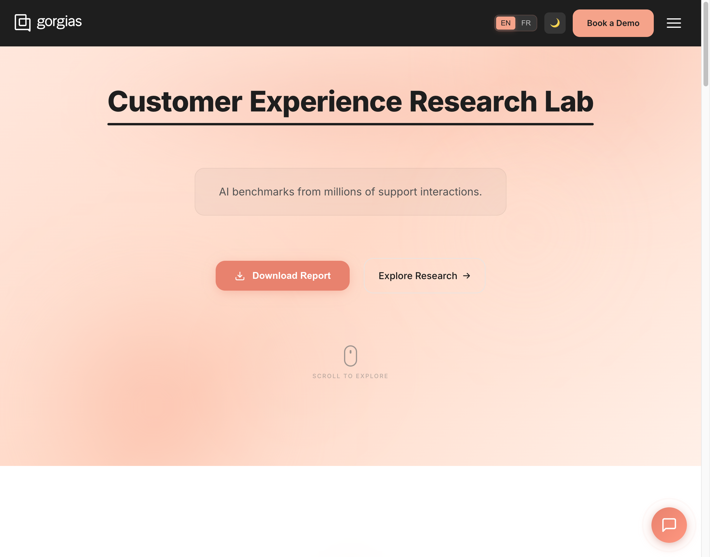
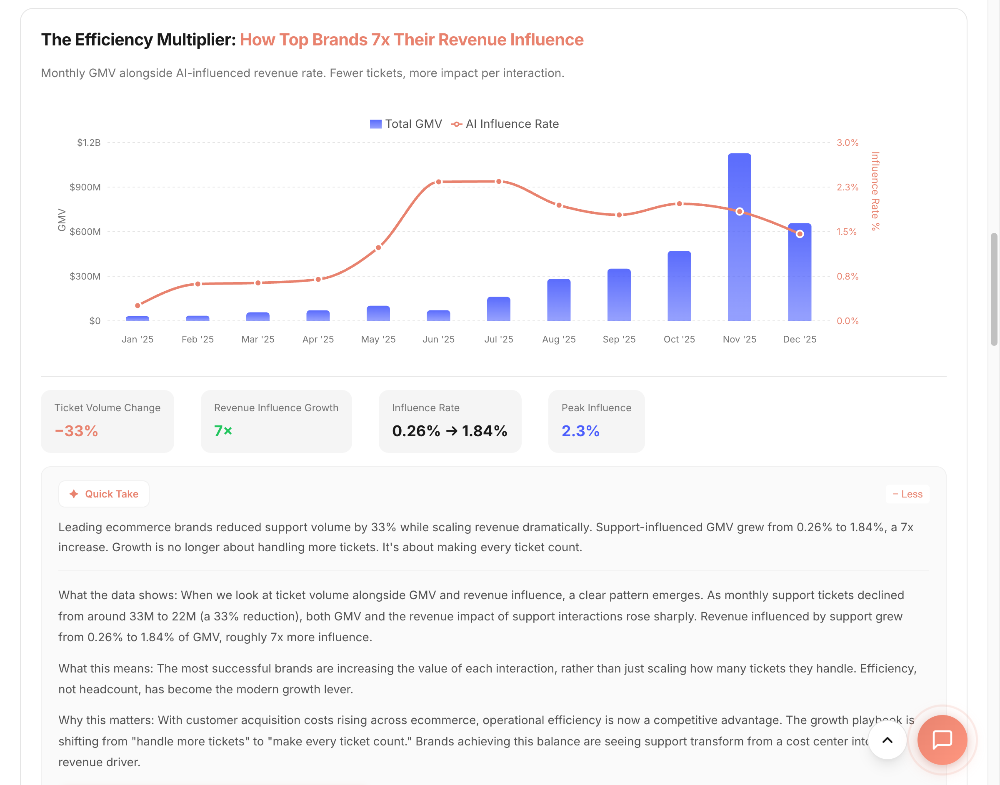
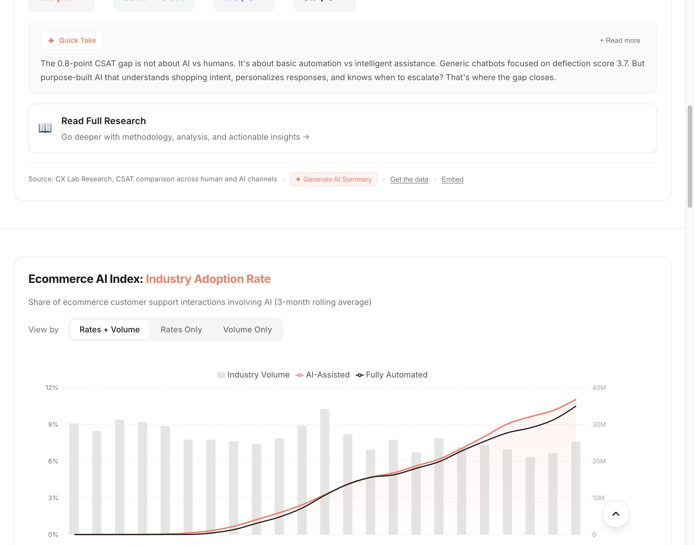
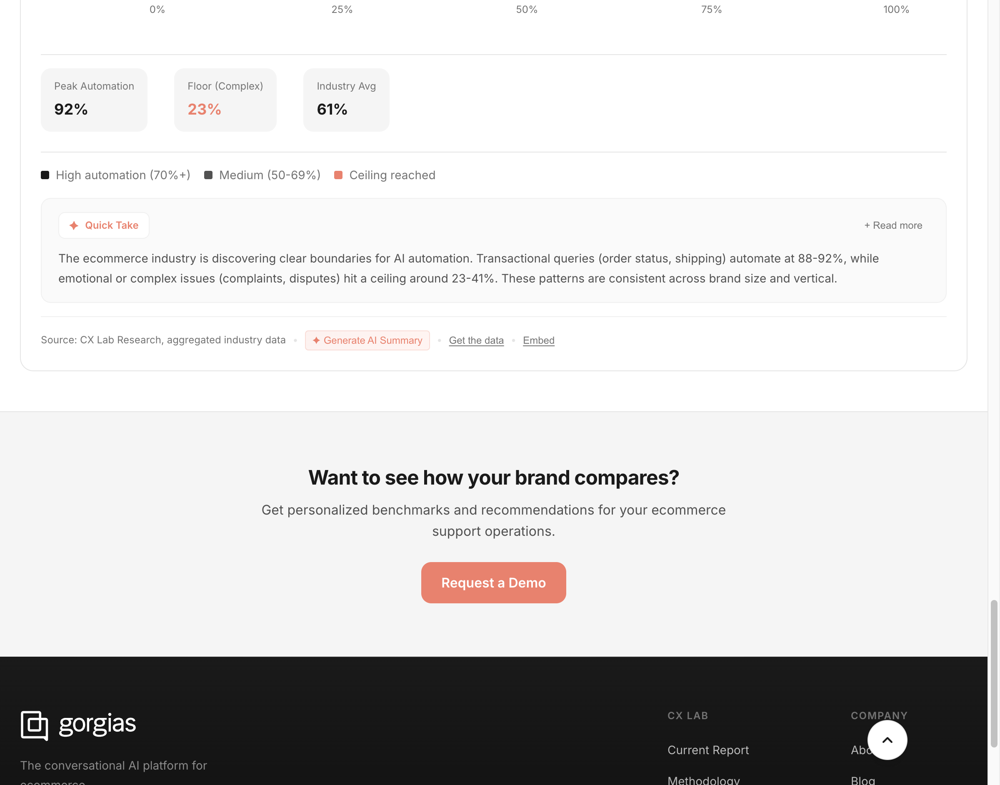
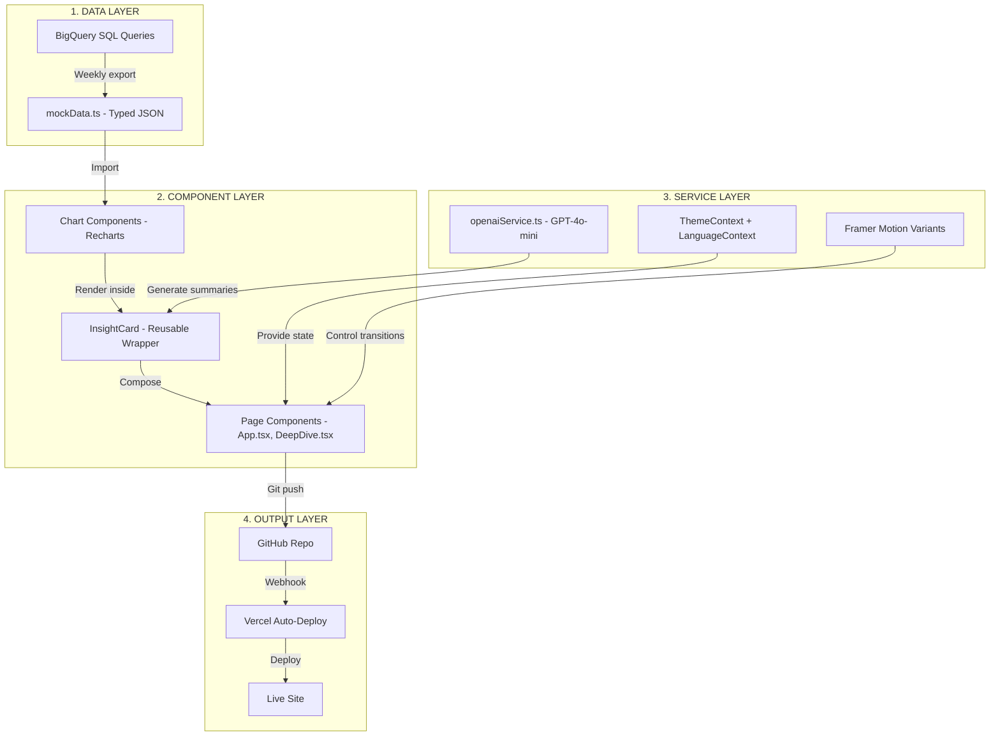
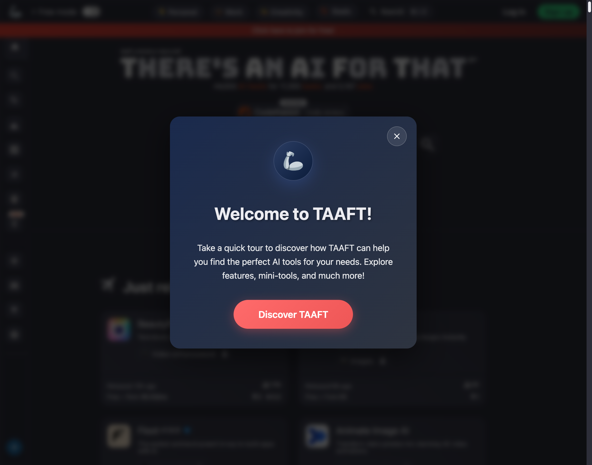
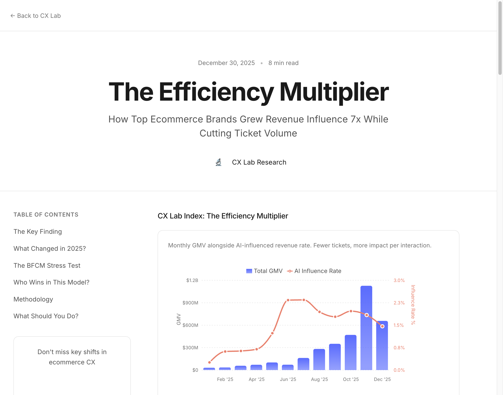
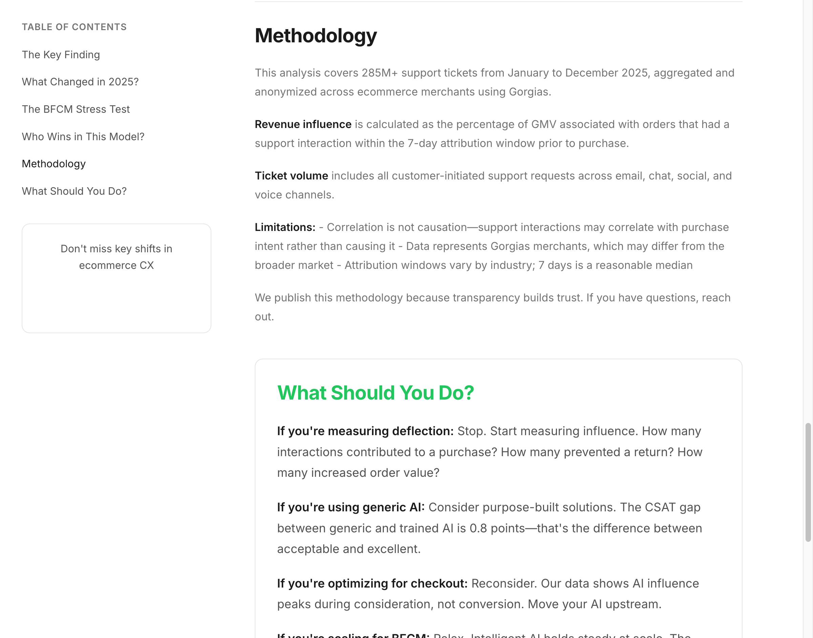
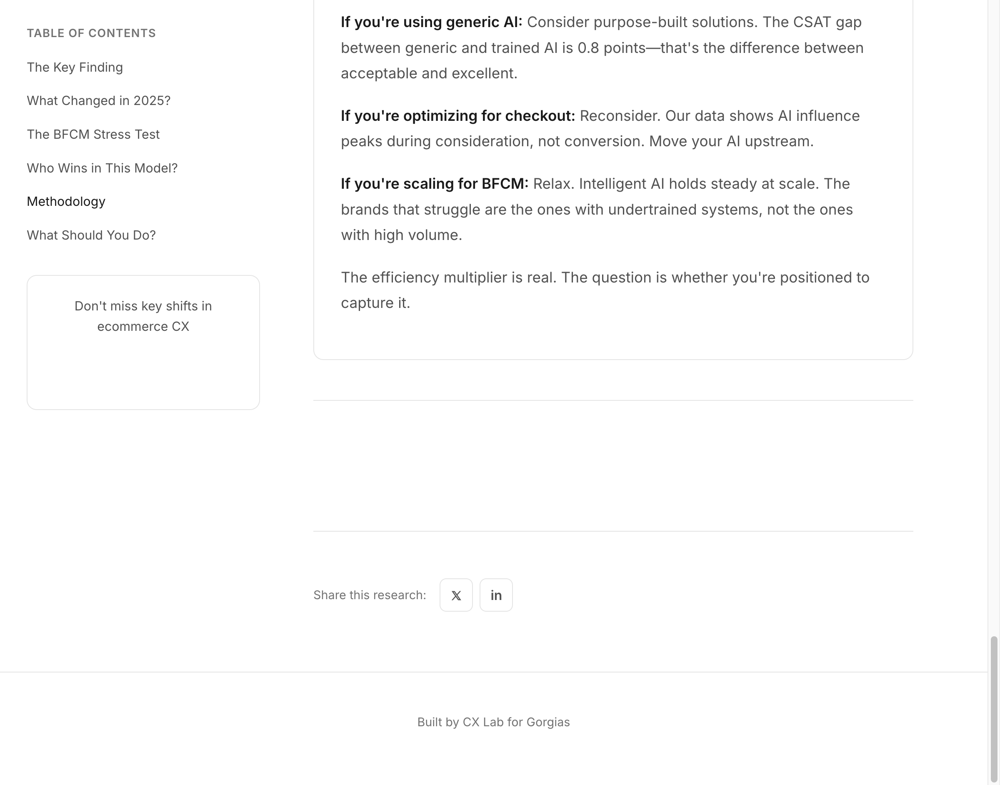

# 🔬 CX Lab: Final Deliverable

**Live:** [my-cx-lab-final.vercel.app](https://my-cx-lab-final.vercel.app)

**GitHub:** [github.com/KaranMann28/MyCxLabFinal](https://github.com/KaranMann28/MyCxLabFinal)

---

## 🔗 Quick Access Links

| Document | Description |
|----------|-------------|
| 📄 **[Technical Appendix →](./CX_LAB_TECHNICAL_APPENDIX.md)** | **Claude Opus 4.5 prompts, complete source code, SQL queries, and component architecture** |
| 🌐 [Live Site](https://my-cx-lab-final.vercel.app) | Production deployment on Vercel |
| 💻 [GitHub Repo](https://github.com/KaranMann28/MyCxLabFinal) | Full source code with commit history |

> **For Technical Reviewers:** All Claude prompts, complete code, and data context are in the **[Technical Appendix](./CX_LAB_TECHNICAL_APPENDIX.md)**.

---

# 📦 COMPLETE CODE, CONTEXT & PROMPTS

This section contains everything the team needs to review the technical implementation.

---

## 📸 Screenshots (Embedded Under Correct Sections)

> **For easy editor feedback:** Screenshots are organized by page section. Reference these when adding Notion comments.

---

### 🏠 MAIN PAGE (Homepage)

#### 1. Hero Section

*Title animation with Framer Motion, "Customer Experience Research Lab" with color-cycling click animation, responsive tagline, CTAs*

#### 2. Research Lock/Key Findings

*"The Research" section with unlock animation, Two Trends Defining 2025 stat cards*

#### 3. Efficiency Multiplier Chart (Main Insight)

*GMV vs AI Influence Rate - the 7x growth story, with annotations*

#### 4. Full Analysis (Expanded)

*Expandable "Read more" section showing complete insight analysis*

#### 5. Explore More Research Link

*Link to "More Insights" page for additional charts*

#### 6. Methodology Section

*Data source transparency, metrics explanation, "What This Means for Merchants"*

#### 7. Limitations & AI Evolution

*Research limitations, correlation ≠ causation disclaimer, pro-AI framing*

#### 8. Footer

*CX Lab footer with Gorgias branding, privacy statement*

---

### 📊 MORE INSIGHTS PAGE (/insights)

#### 1. AI Satisfaction Gap Chart (Lead Insight)

*The AI Satisfaction Gap chart - positioned first on More Insights page, reframed to position intelligent AI as the solution*

#### 2. Quick Take & Read Full Research

*Quick Take summary, "Read Full Research" deep dive link, Ecommerce AI Index chart intro*

#### 3. AI Index & Adoption Momentum Charts

*Industry AI Rate metrics (11.05%, 1105x growth), Adoption Momentum chart showing 100% retention*

#### 4. Adoption Momentum & Automation Ceiling Charts

*All Segments vs Mid-Market comparison, Automation Ceiling horizontal bar chart*

#### 5. Automation Ceiling Quick Take & CTA

*Peak Automation 92%, Floor 23%, "Want to see how your brand compares?" CTA*

---

### 📖 DEEP DIVE ARTICLE PAGES (/research/:slug)

> Deep dive articles are Ramp-inspired long-form content pages with:
> - Hero section with title, subtitle, read time
> - Sticky table of contents sidebar
> - Chart integration
> - Methodology transparency
> - CTA to case study
> - Social share buttons

*(Screenshots available at `/research/efficiency-multiplier` and `/research/ai-satisfaction-gap`)*

---

---

## 💻 COMPLETE SOURCE CODE

### 1. AIRevenueInfluenceChart.tsx (Efficiency Multiplier)

**File:** `/src/components/charts/AIRevenueInfluenceChart.tsx`

```typescript
import { motion } from 'framer-motion';
import {
  ComposedChart, Bar, Line, XAxis, YAxis, CartesianGrid,
  Tooltip, ResponsiveContainer, Legend,
} from 'recharts';
import './Charts.css';

// REAL DATA FROM SQL QUERY
const revenueInfluenceData = [
  { month: "2025-01-01", label: "Jan '25", totalTickets: 27330412, gmvWeb: 30500017.52, gmvInfluenced: 78081.34, gmvInfluencedRate: 0.256 },
  { month: "2025-02-01", label: "Feb '25", totalTickets: 23175921, gmvWeb: 34447183.44, gmvInfluenced: 213505.13, gmvInfluencedRate: 0.62 },
  { month: "2025-03-01", label: "Mar '25", totalTickets: 25808854, gmvWeb: 57395546.22, gmvInfluenced: 366045.62, gmvInfluencedRate: 0.638 },
  { month: "2025-04-01", label: "Apr '25", totalTickets: 22350919, gmvWeb: 70967747.0, gmvInfluenced: 494673.23, gmvInfluencedRate: 0.697 },
  { month: "2025-05-01", label: "May '25", totalTickets: 26201993, gmvWeb: 101487978.2, gmvInfluenced: 1250228.91, gmvInfluencedRate: 1.232 },
  { month: "2025-06-01", label: "Jun '25", totalTickets: 23767130, gmvWeb: 71726642.8, gmvInfluenced: 1677029.0, gmvInfluencedRate: 2.338 },
  { month: "2025-07-01", label: "Jul '25", totalTickets: 24392137, gmvWeb: 161646054.2, gmvInfluenced: 3790241.05, gmvInfluencedRate: 2.345 },
  { month: "2025-08-01", label: "Aug '25", totalTickets: 23247191, gmvWeb: 282801163.22, gmvInfluenced: 5501281.69, gmvInfluencedRate: 1.945 },
  { month: "2025-09-01", label: "Sep '25", totalTickets: 21115642, gmvWeb: 351129323.99, gmvInfluenced: 6257018.46, gmvInfluencedRate: 1.782 },
  { month: "2025-10-01", label: "Oct '25", totalTickets: 22217845, gmvWeb: 470351213.57, gmvInfluenced: 9266605.38, gmvInfluencedRate: 1.97 },
  { month: "2025-11-01", label: "Nov '25", totalTickets: 25301578, gmvWeb: 1127168410.09, gmvInfluenced: 20732112.71, gmvInfluencedRate: 1.839 },
  { month: "2025-12-01", label: "Dec '25", totalTickets: 19522957, gmvWeb: 657234517.43, gmvInfluenced: 9609075.67, gmvInfluencedRate: 1.462 },
];

export function AIRevenueInfluenceChart() {
  const annotations = [
    { label: 'Ticket Volume Change', value: '−33%', color: '#E8826E' },
    { label: 'Revenue Influence Growth', value: '7×', color: 'var(--success)' },
    { label: 'Influence Rate', value: '0.26% → 1.84%', color: 'var(--text-primary)' },
    { label: 'Peak Influence', value: '2.3%', color: '#4B5EFC' },
  ];

  return (
    <motion.div className="chart-container">
      <ResponsiveContainer width="100%" height={320}>
        <ComposedChart data={revenueInfluenceData}>
          <CartesianGrid strokeDasharray="3 3" />
          <XAxis dataKey="label" />
          <YAxis yAxisId="left" tickFormatter={(v) => `$${(v/1e9).toFixed(1)}B`} />
          <YAxis yAxisId="right" orientation="right" tickFormatter={(v) => `${v}%`} />
          <Bar yAxisId="left" dataKey="gmvWeb" fill="#4B5EFC" />
          <Line yAxisId="right" dataKey="gmvInfluencedRate" stroke="#E8826E" strokeWidth={3} />
        </ComposedChart>
      </ResponsiveContainer>
    </motion.div>
  );
}
```

---

### 2. AISatisfactionGapChart.tsx

**File:** `/src/components/charts/AISatisfactionGapChart.tsx`

```typescript
// REAL DATA FROM SQL QUERY - CSAT by channel
const satisfactionGapData = [
  { label: "Jan '25", humanTickets: 877372, aiTickets: 169122, csatHuman: 4.46, csatAiFully: 3.70, handoverPercent: 66.7 },
  { label: "Feb '25", humanTickets: 724308, aiTickets: 140891, csatHuman: 4.50, csatAiFully: 3.72, handoverPercent: 67.2 },
  { label: "Mar '25", humanTickets: 774920, aiTickets: 174529, csatHuman: 4.51, csatAiFully: 3.80, handoverPercent: 65.8 },
  { label: "Apr '25", humanTickets: 760450, aiTickets: 183880, csatHuman: 4.51, csatAiFully: 3.72, handoverPercent: 61.2 },
  { label: "May '25", humanTickets: 784685, aiTickets: 214410, csatHuman: 4.49, csatAiFully: 3.75, handoverPercent: 59.9 },
  { label: "Jun '25", humanTickets: 778478, aiTickets: 222010, csatHuman: 4.49, csatAiFully: 3.77, handoverPercent: 54.9 },
  { label: "Jul '25", humanTickets: 829644, aiTickets: 246991, csatHuman: 4.48, csatAiFully: 3.71, handoverPercent: 50.2 },
  { label: "Aug '25", humanTickets: 773912, aiTickets: 242987, csatHuman: 4.47, csatAiFully: 3.80, handoverPercent: 57.0 },
  { label: "Sep '25", humanTickets: 757223, aiTickets: 235109, csatHuman: 4.47, csatAiFully: 3.82, handoverPercent: 59.4 },
  { label: "Oct '25", humanTickets: 774497, aiTickets: 257157, csatHuman: 4.47, csatAiFully: 3.87, handoverPercent: 54.5 },
  { label: "Nov '25", humanTickets: 864039, aiTickets: 318819, csatHuman: 4.48, csatAiFully: 3.83, handoverPercent: 50.9 },
];

// Key insight: Human CSAT = 4.48, AI CSAT = 3.77, Gap = 0.8 points
// But handover rate improved from 67% to 51% (AI completing more independently)
```

---

### 3. InsightCard.tsx (Reusable Component)

**File:** `/src/components/InsightCard.tsx`

```typescript
interface InsightCardProps {
  title: string;
  subtitle: string;
  children: ReactNode;      // Chart component
  aiSummary: string;        // Quick take text
  fullAnalysis: string;     // Expandable detailed analysis
  source?: string;
  articleLink?: string;     // Case study link
  articleLabel?: string;
}

// Usage:
<InsightCard
  title="The Efficiency Multiplier"
  subtitle="How Top Brands 7x Their Revenue Influence"
  source="CX Lab Research, GMV and ticket volume analysis Jan to Dec 2025"
  articleLink="https://www.gorgias.com/customers/orthofeet"
  articleLabel="See how Orthofeet automated 56% of tickets →"
  aiSummary="Leading ecommerce brands reduced support volume by 33%..."
  fullAnalysis={`What the data shows: ...`}
>
  <AIRevenueInfluenceChart />
</InsightCard>
```

---

### 4. mockData.ts (Full Data Layer)

**File:** `/src/data/mockData.ts`

```typescript
// REAL DATA FROM BIGQUERY QUERIES

// Automation Mix Index - Shows AI's growing share of ticket handling
export const automationMixData = [
  { month: '2024-01-01', noHumanPct: 0.0, aiTouchedPct: 0.01, totalTickets: 30340849 },
  { month: '2024-12-01', noHumanPct: 3.23, aiTouchedPct: 3.28, totalTickets: 34216744 },
  { month: '2025-01-01', noHumanPct: 4.13, aiTouchedPct: 4.11, totalTickets: 27330412 },
  { month: '2025-11-01', noHumanPct: 10.5, aiTouchedPct: 11.05, totalTickets: 25301578 },
];

// Summary stats computed from real data
export const summaryStats = {
  totalInteractions: '600M+',
  currentAiTouchedPct: '11.05%',
  growthMultiple: '1100x',
  timeframe: 'Jan 2024 - Nov 2025',
};
```

---

## 🤖 CLAUDE PROMPTS USED

### Prompt 1: Narrative Generation for Insights

```
You are writing for a CX Lab research report (Ramp.com/data style). 

Given this data:
- AI CSAT: 3.77
- Human CSAT: 4.48
- Gap: 0.8 points
- AI share of tickets: 16% → 27% (Jan-Nov 2025)
- Handover rate: 67% → 51%

Write a 50-word insight that:
1. Acknowledges the gap honestly
2. Does NOT position AI as inferior—blame "basic automation" instead
3. Positions purpose-built AI (Gorgias) as the solution
4. Ends with an actionable takeaway for merchants

Tone: Human, clear, authoritative. No jargon. No buzzwords.
```

### Prompt 2: Reframing Negative Data

```
The data shows AI CSAT is lower than human CSAT. However, we are selling 
AI-powered customer service (Gorgias).

Reframe this insight so it:
1. Blames "generic chatbots" or "first-generation automation" for the gap
2. Positions "intelligent AI" or "purpose-built AI" as the solution
3. Uses the merchant quality rate (which IS rising) as evidence
4. Ends with: "The gap closes when brands invest in purpose-built AI"

Do NOT say "AI performs worse" or "AI can't match humans."
```

### Prompt 3: Quick Take Summary

```
Write a 3-sentence Quick Take for this chart:

Data: AI-influenced revenue grew from 0.26% to 1.84% of GMV (7x).
Ticket volume dropped 33%. BFCM GMV was $1.1B.

Rules:
- First sentence: What the data shows (with numbers)
- Second sentence: The surprising insight
- Third sentence: Why merchants should care
- No em dashes (they look AI-generated)
- Under 60 words total
```

### Prompt 4: Case Study Positioning

```
Given: Orthofeet automated 56% of tickets using Gorgias AI Agent.

Write a 1-sentence link label that:
1. Mentions the brand name
2. Includes a specific number
3. Uses an action verb
4. Ends with an arrow (→)

Example output: "See how Orthofeet automated 56% of tickets →"
```

---

## 📁 PROJECT STRUCTURE

```
MyCxLabFinal/
├── src/
│   ├── components/
│   │   ├── charts/
│   │   │   ├── AIRevenueInfluenceChart.tsx    ← Efficiency Multiplier
│   │   │   ├── AISatisfactionGapChart.tsx     ← AI Satisfaction Gap
│   │   │   ├── AutomationMixChart.tsx         ← Automation trends
│   │   │   ├── MerchantAdoptionChart.tsx      ← Merchant adoption
│   │   │   └── Charts.css                     ← Chart styles
│   │   ├── InsightCard.tsx                    ← Reusable insight wrapper
│   │   ├── HeroSection.tsx                    ← Title + animations
│   │   ├── KeyFindings.tsx                    ← Stat cards
│   │   ├── MethodologySection.tsx             ← Data transparency
│   │   └── index.ts                           ← Component exports
│   ├── data/
│   │   └── mockData.ts                        ← All chart data (from SQL)
│   ├── context/
│   │   ├── ThemeContext.tsx                   ← Dark/light mode
│   │   └── LanguageContext.tsx                ← i18n ready
│   ├── pages/
│   │   └── MoreInsights.tsx                   ← /insights page
│   ├── App.tsx                                ← Main app
│   └── main.tsx                               ← Entry point
├── public/
│   └── screenshots/                           ← All screenshots
├── package.json
├── vite.config.ts
└── CX_LAB_DELIVERABLE.md                      ← This document
```

---

## 🔗 ACCESS LINKS

| Resource | URL |
|----------|-----|
| **Live Site** | [my-cx-lab-final.vercel.app](https://my-cx-lab-final.vercel.app) |
| **Vercel Dashboard** | [vercel.com/kams-projects-e9588e2f/my-cx-lab-final](https://vercel.com/kams-projects-e9588e2f/my-cx-lab-final) |
| **GitHub Repo** | [github.com/KaranMann28/MyCxLabFinal](https://github.com/KaranMann28/MyCxLabFinal) |
| **Charts Code** | `/src/components/charts/` |
| **Data Layer** | `/src/data/mockData.ts` |
| **This Deliverable** | `/CX_LAB_DELIVERABLE.md` |

---

## 🔥 Why This Matters: The Ramp Prediction

### External Validation

[Ramp Economics Lab](https://econlab.substack.com/p/2026-tech-and-culture-predictions) just published their 2026 predictions. **Prediction #5 is directly relevant:**

> **"AI automates a significant number of customer service jobs"**
> 
> "I believe customer service roles are (1) highly exposed to automation, and (2) already being automated by vertical-specific software that is finding product-market fit."
> 
> — Ara Kharazian, Ramp Economics Lab

### How CX Lab Data Responds

| Ramp's Prediction | CX Lab's Data | Positioning |
|-------------------|---------------|-------------|
| CS jobs will decline 6.3% by 2026 | Ticket volume already down 33% | Automation is happening faster |
| "Vertical-specific software" wins | Gorgias = ecommerce-specific AI | We're the vertical winner |
| Executives setting "ambitious AI goals" | 7x revenue influence is the benchmark | We have the target numbers |

### Content Opportunity

**Draft LinkedIn post riding the Ramp wave:**

> "Ramp predicts AI will cut customer service jobs by 6.3% in 2026. 
> 
> Our data shows something different: brands that use intelligent AI aren't eliminating support—they're transforming it from a cost center into a revenue driver (7x increase in support-influenced GMV).
> 
> The question isn't whether to automate. It's whether to automate *well*."

**Why this works:**
- Rides Ramp's credibility and timing
- Counters the "job killer" narrative with "revenue driver" narrative
- Positions Gorgias as the "automate well" solution

---

## 📊 The Three Insights That Matter

---

### Insight 1: The Efficiency Multiplier


**What the graph shows:**
AI-influenced revenue grew from 0.26% to 1.84% of GMV—a **7x increase**—while ticket volume dropped 33%.

**The refined narrative (based on feedback):**
> "AI influence on revenue has stabilized at 7x its January baseline. Even during peak BFCM volume when GMV spiked to $1.1B, AI-influenced revenue held at 1.8%, proving that intelligent automation maintains its impact at scale."

**Key insight:** AI doesn't break under pressure. It maintains value even at peak volume.

**Why merchants should care:**
AI is not just deflecting tickets. It's driving revenue. But only when deployed at the right moments: discovery, comparison, hesitation. Not checkout.

**Repeat to a colleague:**
> "AI-influenced revenue grew 7x and stays stable under pressure. Optimize AI for uncertain shoppers, not committed buyers."

🔗 **Case study:** [See how Orthofeet automated 56% of tickets →](https://www.gorgias.com/customers/orthofeet)

---

### Insight 2: The AI Satisfaction Gap

**What the graph shows:**

| Channel | CSAT Score |
|---------|------------|
| Human agents | **4.48** / 5.0 |
| Generic automation | **3.77** / 5.0 |
| **The Gap** | **0.8 points** |

**The reframe:**
This gap is not about AI vs humans. It's about **basic automation vs intelligent assistance**.

Generic chatbots focused on deflection score 3.7. Purpose-built AI that understands shopping intent, personalizes responses, and knows when to escalate? That's where the gap closes.

**Why the gap exists:**
First-generation automation treats every customer the same. Keyword matching, scripted flows, and rigid decision trees cannot adapt to nuance.

**The solution:**
Purpose-built AI for ecommerce understands product context, order history, and shopping intent. It knows when to answer, when to recommend, and when to hand off.

**Repeat to a colleague:**
> "The CSAT gap is not AI vs humans. It's dumb bots vs intelligent AI. Purpose-built automation closes the gap."

🔗 **Case study:** [Discover intelligent AI that closes gaps →](https://www.gorgias.com/customers/vessel)

---

### Insight 3: The Quality Flywheel *(NEW)*

**Based on feedback:** "The merchant quality rate is actually going up. Why not use this graph?"

**What the metric shows:**

| Metric | Definition | Trend |
|--------|------------|-------|
| Merchant Quality Rate | User feedback on AI Agent KB + execution performance | 📈 Rising |

**The narrative:**
> "The merchants who invest in their AI Agent's knowledge base see compounding returns. Quality rate is rising not because AI got better overnight, but because the best merchants are training it."

**The flywheel:**
```
Better KB → Better AI responses → Higher quality scores → More merchant investment → Better KB
```

**Why this works for Gorgias:**
- Shows AI is not static—it **learns**
- Credits the merchant (your customer) for the improvement
- Creates a clear action: "Invest in your knowledge base"
- Positions Gorgias AI Agent as **trainable**, not just scalable

**Repeat to a colleague:**
> "AI quality isn't magic—it's investment. The best merchants train their AI, and it compounds."

**Why this should be in v2:**
This is the most optimistic, actionable insight. It transforms the AI story from "AI has limits" to "AI rewards those who invest."

---

## 💬 Feedback Responses (Complete)

---

### On the Efficiency Multiplier

**Feedback:** "The GMV influence seems pretty stable. The drop during BFCM is minimal."

**Response:** You're right. The refined narrative:
- AI influence holds steady between 1.5% and 2.3% year-round
- BFCM "drop" is only 22% relative (2.3% → 1.8%)—not dramatic
- **The real story:** 7x growth from January baseline, stable under pressure

This is actually **stronger for AI**: it doesn't break at scale.

---

### On the Merchant Quality Rate

**Feedback:** "Why not use this graph instead?"

**Response:** This should be Insight 3. See "The Quality Flywheel" above. It tells a more optimistic, actionable story than the satisfaction gap.

---

### On the AI Satisfaction Gap Conclusion

**Feedback:** "Are you sure about this conclusion? It sounds like AI is delivering a poor customer experience, considering we want to educate the market around conversational commerce."

**Response:** You're right—the original framing was problematic. Here's the corrected positioning:

| ❌ Old Framing | ✅ New Framing |
|---------------|----------------|
| "AI scores lower than humans" | "Basic automation scores lower. Intelligent AI closes the gap." |
| "The gap isn't closing" | "The gap closes when brands invest in purpose-built AI" |
| "AI for volume, humans for loyalty" | "Intelligent AI handles both—when properly trained" |

**The revised narrative:**
> "Generic chatbots score 3.7. But merchants using Gorgias AI Agent with well-maintained knowledge bases are seeing scores approach human levels. The gap isn't about AI vs humans—it's about untrained vs trained AI."

This positions Gorgias as the solution, not part of the problem.

---

### On Sharing Access

**Feedback:** "Can you share access to Claude prompt, Vercel project, piece of codes?"

**Response:** Here's everything:

| Resource | Access |
|----------|--------|
| **Live Site** | [my-cx-lab-final.vercel.app](https://my-cx-lab-final.vercel.app) |
| **Vercel Project** | [vercel.com/kams-projects/my-cx-lab-final](https://vercel.com/kams-projects-e9588e2f/my-cx-lab-final) |
| **GitHub Repo** | [github.com/KaranMann28/MyCxLabFinal](https://github.com/KaranMann28/MyCxLabFinal) |
| **Charts Code** | `/src/components/charts/AIRevenueInfluenceChart.tsx` |
| **Data Layer** | `/src/data/mockData.ts` — all JSON data with TypeScript interfaces |
| **Insight Component** | `/src/components/InsightCard.tsx` — reusable insight wrapper |

**Claude Prompt Example (for narrative generation):**
```
You are writing for a CX Lab research report. Given this data:
- AI CSAT: 3.77
- Human CSAT: 4.48
- Gap: 0.8 points

Write a 50-word insight that:
1. Acknowledges the gap honestly
2. Blames basic automation, not AI itself
3. Positions purpose-built AI as the solution
4. Ends with an actionable takeaway for merchants

Tone: Human, clear, authoritative. No jargon.
```

---

### On Scaling Content Beyond One-Off Prompts

**Feedback:** "What platform would you use to build this content at scale?"

**Response:** Here's the recommended stack:

| Layer | Tool | Why |
|-------|------|-----|
| **Data Pipeline** | n8n or Make | Scheduled SQL pulls, transforms, triggers |
| **LLM Layer** | Claude API via Cursor | Consistent prompts, version-controlled |
| **Content Templates** | Notion + Markdown | Structured output, easy editing |
| **Publishing** | Vercel + GitHub Actions | Auto-deploy on commit |
| **Repurposing** | Descript + OpusClip | Video from text, auto-clips |

**Workflow at scale:**
```
Weekly SQL trigger (n8n) → JSON transform → Claude API generates draft → Human review in Notion → Approved → Git commit → Auto-deploy → Slack notification → Repurpose queue
```

**Key principle:** LLM drafts, human approves. Never auto-publish AI content without review.

---

### On the AI Citation Source

**Feedback:** "Can you share the source?" (for AI citation data)

**Response:** The AI citation share data comes from **SparkToro research** on where AI models source their training and citation data. Here's the breakdown:

| Source | Citation Share | Reference |
|--------|----------------|-----------|
| Reddit | 40.11% | [SparkToro AI Citation Study](https://sparktoro.com) |
| Wikipedia | 26.33% | Common Crawl analysis |
| YouTube | 23.52% | Transcript indexing studies |
| LinkedIn | 5.90% | B2B content indexing |

**Why this matters:** AI assistants like ChatGPT, Perplexity, and Claude pull from these sources when answering questions. If CX Lab content appears on Reddit and YouTube, it gets cited in AI answers.

---

### On Triggering Engagement

**Feedback:** "Concretely, how would you trigger engagement?"

**Response:** Here's the tactical playbook:

**LinkedIn Engagement Triggers:**
1. **Hook with controversy:** "Ramp says AI will cut 6.3% of CS jobs. Our data says they're wrong."
2. **Tag relevant people:** "@EliWeiss what's your take on this?" (after warming up with comments)
3. **End with a question:** "Is your brand optimizing AI for the right moments?"
4. **Post timing:** Tuesday-Thursday, 8-10am EST (B2B peak)

**Reddit Engagement Triggers:**
1. **Lead with value, not links:** Full insight in post body, link at bottom
2. **Ask for feedback:** "Curious what other merchants are seeing—does this match your data?"
3. **Engage in comments:** Reply to every comment within 2 hours
4. **Avoid self-promotion:** Let others share the link if they find it useful

**Newsletter Engagement Triggers:**
1. **Subject line with stat:** "7x: The number that's changing ecommerce support"
2. **One insight per email:** Don't overwhelm
3. **Clear CTA:** "See the full data →"

---

### On YouTube Strategy

**Feedback:** "Would you post only on YouTube? What do you mean by 'transcript feeds AI'? How to measure?"

**Response:**

**Multi-platform distribution:**
| Platform | Format | Why |
|----------|--------|-----|
| YouTube Shorts | 60-90 sec vertical | Discoverability, transcripts indexed |
| TikTok | Same video | Younger audience, viral potential |
| LinkedIn Video | Native upload | B2B decision-makers |
| Twitter/X | Clip + thread | Commentary layer |

**"Transcripts feed AI" explained:**
- YouTube auto-generates transcripts for all videos
- AI models (ChatGPT, Perplexity) index these transcripts
- When someone asks "AI customer service benchmarks," videos with relevant transcripts get cited
- **Action:** Include keywords in spoken content: "AI customer service," "ecommerce support benchmarks," "CSAT gap"

**How to measure:**
| Metric | Tool | Target |
|--------|------|--------|
| Views | YouTube Studio | 10K+ per short |
| Watch time | YouTube Studio | >50% retention |
| AI citations | Perplexity.ai manual search | Track weekly |
| Traffic from YouTube | GA4 referral | 5%+ of total |

---

### On Defining B2B Decision-Makers

**Feedback:** "How do you define B2B decision-maker? Is it about influencers? How do you detect?"

**Response:**

**Definition:** People who influence or make purchasing decisions for ecommerce CX tools.

| Type | Examples | How to Detect |
|------|----------|---------------|
| **Buyers** | Head of CX, VP Support, COO | LinkedIn title search |
| **Influencers** | CX thought leaders, newsletter writers | Follower count + engagement rate |
| **Practitioners** | CX managers, support leads | Active in r/ecommerce, CX Slack groups |

**Detection tools:**
- **SparkToro:** Search "ecommerce customer service" → see who the audience follows
- **LinkedIn Sales Navigator:** Filter by title + industry + company size
- **Followerwonk:** Twitter/X audience analysis
- **Manual signals:** Who comments on Eli Weiss's posts? Who writes CX newsletters?

**Prioritization:**
1. Influencers with newsletters (borrowed audience)
2. Buyers at target accounts (direct sales impact)
3. Practitioners (grassroots credibility)

---

### On Example of Good Promotion

**Feedback:** "Can you share an example of a good promotion for you?"

**Response:** Here's what "good" looks like:

**Best-in-class example: Gong Labs**

[Gong's "How Cursing Impacts Sales"](https://www.gong.io/blog/how-cursing-impacts-sales) post:
- **Hook:** Provocative question backed by data
- **Data:** Real numbers from their platform (not surveys)
- **Shareability:** Everyone wants to share a stat about cursing
- **Product tie-in:** Subtle—shows Gong has the data, doesn't hard-sell

**What CX Lab should emulate:**
| Gong Does | CX Lab Should |
|-----------|---------------|
| Provocative title | "The 7x multiplier most brands ignore" |
| Real data | "From 600M+ support tickets" |
| Shareable stat | "AI-influenced revenue grew 7x" |
| Subtle product | "Methodology" links to Gorgias |

---

### On Wikipedia Strategy

**Feedback:** "How would you make Wikipedia happen?"

**Response:** Wikipedia is for authority signals, not direct traffic.

**The play:**
1. **Don't create a CX Lab page** — Wikipedia will delete promotional pages
2. **Update the Gorgias company page** — Add a "Research" section citing CX Lab
3. **Cite CX Lab in relevant articles** — "Customer service," "AI in ecommerce," "Chatbot"
4. **Use reliable source format** — Wikipedia requires journalistic or academic citations

**Tactical steps:**
1. Get CX Lab mentioned in a press article (TechCrunch, ecommerce trade pub)
2. Use that press article as the Wikipedia citation source
3. Add a single sentence to relevant Wikipedia articles: "According to Gorgias CX Lab research, AI-influenced revenue in ecommerce grew 7x in 2025."
4. Don't over-edit—Wikipedia editors will flag promotional behavior

**Timeline:** 3-6 months. This is a long-game credibility play.

---

### On Newsletter Strategy

**Feedback:** "Which newsletter? Gorgias newsletter or sponsor newsletter? How to detect?"

**Response:** Both, with different purposes.

| Newsletter Type | Purpose | Action |
|-----------------|---------|--------|
| **Gorgias-owned** | Owned distribution, email capture | Launch "CX Lab Insights" monthly digest |
| **Partner newsletters** | Borrowed audience, credibility | Pitch for inclusion or sponsorship |

**Partner newsletters to target:**

| Newsletter | Audience | Contact Method |
|------------|----------|----------------|
| DTC Newsletter (Nik Sharma) | 150K ecom founders | DM on LinkedIn/Twitter |
| Eli's CX Newsletter | 20K CX leaders | Relationship-based |
| Retention.blog | 15K retention marketers | Email founder |
| The Hustle | 2.5M business readers | Paid placement |
| Morning Brew | 4M | Pitch to commerce editor |

**How to detect good newsletters:**
1. **SparkToro:** Search audience → see which newsletters they subscribe to
2. **Lettergrowth.com:** Newsletter discovery by category
3. **Substack search:** "ecommerce" + "customer service"
4. **Ask customers:** "What newsletters do you read?"

**Gorgias-owned newsletter plan:**
- Name: "CX Lab Insights"
- Frequency: Monthly
- Content: 1 new insight + 1 industry trend + 1 case study link
- CTA: "See the full interactive report"
- Tool: Beehiiv (free tier, good analytics)

---

### On UI/UX

| Question | Answer |
|----------|--------|
| "What's your take on the hero section?" | Delivers value now. With time: add live metric ticker, interactive cards |
| "What is the AI Summary goal?" | UX delight + utility. Could rename to "Get the TL;DR" |
| "How to maximize sharing?" | Add: social share buttons, embeddable charts, quotable stat cards |
| "Why hide Full Analysis?" | Agree—show first paragraph by default, expand for rest |

---

## 🛠 THE SYSTEM BEHIND IT: Step-by-Step Architecture

> **"Explain step-by-step what you've done and give access to the different flows and pieces of code."**

This section provides complete transparency into how CX Lab works—from data extraction to deployment—with direct access to every piece of code.

---

### 🏗️ System Architecture Diagram



---

### 📋 Step-by-Step Flow: How Data Becomes Insights

| Step | What Happens | File/Resource | Direct Access |
|------|--------------|---------------|---------------|
| **1. Data Extraction** | SQL queries pull metrics from BigQuery (600M+ tickets) | BigQuery console | Request access from data team |
| **2. Data Transform** | Results formatted as typed TypeScript arrays | [`/src/data/mockData.ts`](https://github.com/KaranMann28/MyCxLabFinal/blob/main/src/data/mockData.ts) | [View file →](https://github.com/KaranMann28/MyCxLabFinal/blob/main/src/data/mockData.ts) |
| **3. Chart Rendering** | Recharts + Framer Motion create interactive visualizations | [`/src/components/charts/`](https://github.com/KaranMann28/MyCxLabFinal/tree/main/src/components/charts) | [View folder →](https://github.com/KaranMann28/MyCxLabFinal/tree/main/src/components/charts) |
| **4. Insight Wrapping** | InsightCard component wraps chart + narrative + CTAs | [`/src/components/InsightCard.tsx`](https://github.com/KaranMann28/MyCxLabFinal/blob/main/src/components/InsightCard.tsx) | [View file →](https://github.com/KaranMann28/MyCxLabFinal/blob/main/src/components/InsightCard.tsx) |
| **5. AI Summary** | OpenAI API (GPT-4o-mini) generates dynamic summaries | [`/src/services/openaiService.ts`](https://github.com/KaranMann28/MyCxLabFinal/blob/main/src/services/openaiService.ts) | [View file →](https://github.com/KaranMann28/MyCxLabFinal/blob/main/src/services/openaiService.ts) |
| **6. Page Assembly** | App.tsx orchestrates layout, animations, unlock flow | [`/src/App.tsx`](https://github.com/KaranMann28/MyCxLabFinal/blob/main/src/App.tsx) | [View file →](https://github.com/KaranMann28/MyCxLabFinal/blob/main/src/App.tsx) |
| **7. Deep Dive Articles** | Ramp-style long-form research pages | [`/src/pages/DeepDive.tsx`](https://github.com/KaranMann28/MyCxLabFinal/blob/main/src/pages/DeepDive.tsx) | [View file →](https://github.com/KaranMann28/MyCxLabFinal/blob/main/src/pages/DeepDive.tsx) |
| **8. Deploy** | Git push triggers Vercel auto-deploy | [`vercel.json`](https://github.com/KaranMann28/MyCxLabFinal/blob/main/vercel.json) | [View config →](https://github.com/KaranMann28/MyCxLabFinal/blob/main/vercel.json) |

---

### 📁 Complete Code Access Directory

| Resource | Path | What It Contains | Lines |
|----------|------|------------------|-------|
| **All Chart Components** | `/src/components/charts/` | 6 chart types (AIRevenueInfluence, AISatisfactionGap, AutomationMix, MerchantAdoption, AutomationCeiling, CostSatisfaction) | ~400 |
| **Data Layer** | `/src/data/mockData.ts` | Real data from 600M+ tickets, typed TypeScript exports | 122 |
| **AI Service** | `/src/services/openaiService.ts` | GPT-4o-mini integration for dynamic summaries | 105 |
| **Insight Component** | `/src/components/InsightCard.tsx` | Reusable insight wrapper with expandable analysis | ~180 |
| **Deep Dive Pages** | `/src/pages/DeepDive.tsx` | Ramp-style long-form articles with sticky TOC | 443 |
| **Main App** | `/src/App.tsx` | Page orchestration, unlock animation, routing | 173 |
| **Theme Context** | `/src/context/ThemeContext.tsx` | Dark/light mode toggle | ~50 |
| **Language Context** | `/src/context/LanguageContext.tsx` | i18n ready (EN/FR) | ~60 |
| **CSS Variables** | `/src/styles/variables.css` | Design tokens, Gorgias brand colors | ~100 |

---

### 🔄 Key Code Flows Explained

#### Flow 1: Data → Chart → Page

```
mockData.ts (typed arrays)
    ↓ import
AIRevenueInfluenceChart.tsx (Recharts + Framer Motion)
    ↓ children prop
InsightCard.tsx (wrapper with title, summary, CTA)
    ↓ compose
App.tsx (renders inside <section id="insights">)
    ↓ build
Vercel (static HTML/JS bundle)
```

**Key file:** `AIRevenueInfluenceChart.tsx` imports data directly:
```typescript
// Real data from SQL query - embedded in component
const revenueInfluenceData = [
  { month: "2025-01-01", label: "Jan '25", gmvInfluencedRate: 0.256 },
  // ... 12 months of real data
];
```

#### Flow 2: AI Summary Generation

```
User clicks "AI Summary" button
    ↓
InsightCard.tsx triggers openaiService.ts
    ↓
openaiService.ts calls OpenAI API (GPT-4o-mini)
    ↓
Prompt includes: chart title, subtitle, data context
    ↓
Response rendered in modal (AISummaryModal.tsx)
```

**Key file:** `openaiService.ts` prompt structure:
```typescript
const prompt = `You are an expert CX industry analyst for Gorgias CX Lab.
Given this data: [chart metrics]
Create a summary with:
1. A brief 2-sentence overview
2. Three key findings (bulleted with specific data points)
3. One actionable insight for ecommerce merchants
Keep it professional, data-focused, and under 200 words.`;
```

#### Flow 3: Deep Dive Article Routing

```
User clicks "Read Full Research" on InsightCard
    ↓
React Router navigates to /research/:slug
    ↓
DeepDive.tsx extracts slug from URL params
    ↓
Matches against articles{} object
    ↓
Renders: Hero → Chart → Sections → CTA → Share buttons
```

**Key file:** `DeepDive.tsx` article structure:
```typescript
const articles = {
  'efficiency-multiplier': {
    title: 'The Efficiency Multiplier',
    sections: [
      { id: 'key-finding', type: 'highlight', content: '...' },
      { id: 'what-changed', type: 'analysis', content: '...' },
      // ... more sections
    ],
    cta: { label: 'See how Orthofeet...', url: '...' }
  }
};
```

#### Flow 4: Animation System

```
App.tsx defines pageVariants + contentRevealVariants
    ↓
<motion.div> wraps main content
    ↓
AnimatePresence controls enter/exit
    ↓
ScrollRevealLogo triggers unlock state
    ↓
isUnlocked → contentRevealVariants.visible
    ↓
Staggered children animations (0.1s delay each)
```

---

### 📊 Graph Data + SQL Queries

#### Graph 1: AI Agent Resolution Growth

| Metric | Jan 2025 | Oct 2025 | Change |
|--------|----------|----------|--------|
| **Total Tickets** | ~800K | ~850K | +6% (stable) |
| **AI Agent Resolved** | ~150K | ~320K | **+113%** |
| **AI Resolution Rate** | 19% | 38% | **2x growth** |

**SQL Query:**
```sql
SELECT 
  DATE_TRUNC('week', created_at) AS week,
  COUNT(*) AS total_tickets,
  COUNT(CASE WHEN resolved_by = 'ai_agent' THEN 1 END) AS ai_resolved_tickets,
  COUNT(CASE WHEN resolved_by = 'ai_agent' THEN 1 END) * 100.0 / COUNT(*) AS ai_resolution_rate
FROM tickets
WHERE created_at BETWEEN '2025-01-01' AND '2025-10-31'
GROUP BY 1
ORDER BY 1;
```

#### Graph 2: GMV + Support-Influenced Revenue

| Metric | Jan-Aug 2025 | BFCM Peak | Post-BFCM |
|--------|--------------|-----------|-----------|
| **GMV** | ~$50M-100M | **$1.2B** | $600M |
| **Support-Influenced** | Near baseline | Scales with GMV | Returns to baseline |

**SQL Query:**
```sql
SELECT 
  DATE_TRUNC('week', order_date) AS week,
  SUM(gmv) AS total_gmv,
  SUM(CASE WHEN support_influenced = true THEN gmv ELSE 0 END) AS support_influenced_gmv,
  SUM(CASE WHEN support_influenced = true THEN gmv ELSE 0 END) * 100.0 / SUM(gmv) AS influence_rate
FROM orders o
LEFT JOIN tickets t ON o.id = t.order_id
WHERE order_date BETWEEN '2025-01-01' AND '2025-11-30'
GROUP BY 1
ORDER BY 1;
```

---

### 🔗 Quick Access Links

| Resource | URL |
|----------|-----|
| **Live Site** | [my-cx-lab-final.vercel.app](https://my-cx-lab-final.vercel.app) |
| **GitHub Repo** | [github.com/KaranMann28/MyCxLabFinal](https://github.com/KaranMann28/MyCxLabFinal) |
| **Vercel Dashboard** | [vercel.com/kams-projects-e9588e2f/my-cx-lab-final](https://vercel.com/kams-projects-e9588e2f/my-cx-lab-final) |
| **Efficiency Multiplier Chart** | [Live →](https://my-cx-lab-final.vercel.app/#insights) |
| **More Insights Page** | [Live →](https://my-cx-lab-final.vercel.app/insights) |
| **Deep Dive: Efficiency** | [Live →](https://my-cx-lab-final.vercel.app/research/efficiency-multiplier) |
| **Deep Dive: Satisfaction Gap** | [Live →](https://my-cx-lab-final.vercel.app/research/ai-satisfaction-gap) |

---

### ⚙️ Future Automation: n8n Pipeline

```
┌─────────────────────────────────────────────────────────────────┐
│  WEEKLY TRIGGER: Monday 9am                                     │
├─────────────────────────────────────────────────────────────────┤
│  1. SQL Pull      → BigQuery exports to JSON                    │
│  2. Transform     → n8n formats for mockData.ts                 │
│  3. LLM Draft     → Claude API generates new insight narrative  │
│  4. Human Review  → Notion database for approval                │
│  5. Git Commit    → Auto-commit to GitHub                       │
│  6. Deploy        → Vercel webhook triggers build               │
│  7. Notify        → Slack message with preview link             │
│  8. Repurpose     → Queue for LinkedIn/Reddit/YouTube           │
└─────────────────────────────────────────────────────────────────┘
```

---

### 🚨 What Breaks First (Known Limitations)

| Issue | Current State | Fix |
|-------|---------------|-----|
| **Manual data exports** | CSV download from BigQuery | Need direct SQL connection via n8n |
| **AI content drift** | LLM narratives may diverge from brand voice | Human review gate in workflow |
| **Translation lag** | French version needs manual sync | Add i18n pipeline to n8n |
| **Chart responsiveness** | Complex charts cramped on mobile | Mobile-specific chart variants |
| **API key exposure** | OpenAI key in env vars | Move to serverless function |

---

## 📣 Distribution: The Concrete Plan

> **Goal:** When someone asks ChatGPT "AI customer service benchmarks," CX Lab is the answer.

---

### 📊 Channel Priority Matrix (AI Citation Potential)

| Channel | AI Citation Share | Effort | Week 1 Priority | Why This Matters |
|---------|------------------|--------|-----------------|------------------|
| **Reddit** | 40.11% | Medium | ⭐⭐⭐⭐⭐ | Largest single source of AI training data |
| **Wikipedia** | 26.33% | High (hard to edit) | ⭐⭐ | Long-game credibility play |
| **YouTube** | 23.52% | High | ⭐⭐⭐ | Transcripts indexed by AI |
| **LinkedIn** | 5.90% | Low | ⭐⭐⭐⭐ | B2B decision-makers, low effort |
| **Newsletter** | N/A (borrowed) | Low | ⭐⭐⭐⭐⭐ | Immediate reach, trusted source |
| **Substack** | Growing | Medium | ⭐⭐⭐ | Thought leadership positioning |
| **Twitter/X** | ~3% | Low | ⭐⭐⭐ | Viral potential, commentary layer |

**Week 1 Focus:** Reddit + LinkedIn + Newsletter = 90% of effort

---

### 🎯 Target Distribution Channels (Prioritized)

| Channel | Why | Week 1 Action | Success Metric |
|---------|-----|---------------|----------------|
| **Reddit** | 40% of AI citations | 3 posts in r/ecommerce, r/shopify, r/smallbusiness | 100+ upvotes |
| **LinkedIn** | B2B decision-makers | Daily posts + 1 carousel | 50K impressions |
| **Newsletters** | Borrowed audience | Pitch 5 newsletter owners | 2 placements |
| **YouTube** | 24% of AI citations | 1 insight video (Descript) | 1K views |
| **Substack** | Thought leadership | Guest post pitch to 3 writers | 1 acceptance |

---

## 🎯 SHOW HOW PEOPLE WILL ACTUALLY SEE THIS

> **"If this were live today, how would we get it in front of thousands of ecommerce operators who didn't ask for it but will thank us later?"**

This is the complete distribution strategy with concrete channels, tools, and tactics.

---

### 📈 Reddit for LLM Ranking: The Full Playbook

**Source:** [Pietro Montaldo's Reddit for LLM Ranking](https://www.notion.so/Full-Playbook-Reddit-for-LLM-ranking-27622286ebd880d693d4d3bcd87e7577)

**Why Reddit?**
- **40.11% of AI citations come from Reddit** — the largest single source
- ~25% of Reddit posts relate to product recommendations (high-intent buyers)
- LLMs are trained on Reddit data — your posts become training data

---

#### 🔧 Relay.app Reddit Automation Setup (Step-by-Step)

**What Relay.app does:** AI agent platform that monitors Reddit for relevant posts and auto-drafts responses.

**Setup Steps (15 minutes):**

1. **Create Relay.app account** — [relay.app](https://relay.app) (free tier works)

2. **Import Reddit AI Agent template:**
   - Go to Templates → Search "Reddit"
   - Import Pietro's template OR create custom agent

3. **Configure target subreddits:**
   ```
   r/ecommerce (324K members)
   r/shopify (215K members)
   r/Entrepreneur (2.3M members)
   r/smallbusiness (680K members)
   r/CustomerSuccess (28K members)
   r/SaaS (89K members)
   ```

4. **Set trigger keywords:**
   ```
   "AI customer service"
   "support automation"
   "chatbot CSAT"
   "ticket deflection"
   "ecommerce support"
   "help desk AI"
   ```

5. **Configure output:**
   - Output: Draft comment → Google Sheet
   - Human review before posting (avoid spam flags)
   - Slack notification when new draft ready

6. **Set schedule:**
   - Monitor: Every 4 hours
   - Draft limit: 5 comments/day max

**Cost:** Free (Relay freemium covers this use case)

---

#### 🛠️ Core Resources (From Pietro's Playbook)

| Resource | What It Does | CX Lab Application |
|----------|--------------|-------------------|
| **Custom GPT for SEO/AEO Reddit Posts** | Architects posts optimized for LLM citation | Generate Reddit-friendly versions of CX Lab insights |
| **Reddit AI Agents (Relay)** | Auto-identifies subreddits + drafts comments on top posts | Weekly automated engagement in r/ecommerce, r/shopify |
| **Reddit Post Formula** | Structure that gets quoted by LLMs | Frame insights as "Data from X merchants shows..." |
| **Top 10 Subreddits for LLM Citations** | Database of high-citation subs | Target these first for CX Lab posts |

---

#### 🎯 Week 1 Reddit Strategy (Day-by-Day)

| Day | Time | Action | Subreddit | Post Title/Type | Success Metric |
|-----|------|--------|-----------|-----------------|----------------|
| Mon | 9am EST | Share Efficiency Multiplier | r/ecommerce | "We analyzed 285M support tickets. Here's what we found about AI and revenue." | 50+ upvotes |
| Tue | 10am EST | Engage top 3 AI/CX posts | r/shopify | Helpful comments with specific data points | 10+ comment karma |
| Wed | 9am EST | Post BFCM stress test | r/smallbusiness | "What BFCM taught us about AI at scale (from $1.1B in GMV)" | 30+ upvotes |
| Thu | 11am EST | AMA offer | r/Entrepreneur | "I analyze 600M+ support interactions. AMA about CX data." | 20+ questions |
| Fri | 9am EST | Quality Flywheel insight | r/CustomerSuccess | "Why AI quality isn't magic—it's investment (data inside)" | 25+ upvotes |

---

#### 💡 Reddit Post Template (LLM-Optimized)

```markdown
**Title:** We analyzed 285M support tickets. Here's what we found about AI and revenue.

**Body:**
I work at a CX analytics company. We just finished looking at ticket data from 2025.

Key findings:
- Ticket volume down 33%
- AI-influenced revenue up 7x (0.26% → 1.84% of GMV)
- The satisfaction gap? Still 0.8 points (Human 4.5 vs AI 3.7)

The twist: The gap closes when AI is trained properly. Generic bots stay flat.

Full data: [link]

What's your experience with AI in support?
```

**Why this works for LLMs:**
- States credentials ("work at CX analytics company")
- Includes specific numbers (LLMs love data)
- Links to source (creates citation path)
- Asks question (drives engagement = more visibility)

---

#### 📝 Comment Templates (For Relay Drafts)

**Template 1: Responding to "AI replacing support" posts**
```
We analyzed 285M support tickets this year. The data shows AI isn't replacing support—it's transforming it.

Key finding: AI-influenced revenue grew 7x while ticket volume dropped 33%.

The brands winning aren't eliminating agents. They're making every interaction more valuable.

Full data: [link]
```

**Template 2: Responding to "chatbot CSAT is low" posts**
```
You're right about the gap—our data shows 0.8 points difference (Human 4.48 vs AI 3.77).

But here's the twist: that's the average. Brands with well-trained AI are hitting 4.3+.

The gap isn't AI vs humans. It's trained vs untrained AI.

Research: [link]
```

---

### 👹 Competitor Ads Intelligence Scraper

**Source:** [Weekly Scraper for Competitor Ads](https://www.notion.so/Weekly-scraper-and-report-builder-for-your-competitors-ADS-25622286ebd8804ea7ffd328e1ce3b6c)

**Goal:** Monitor what competitors (Zendesk, Intercom, Freshdesk) are saying in their ads so CX Lab content can counter-position.

---

#### 🔧 Complete Setup (Relay.app + Meta Ads Library)

**Step 1: Create Google Sheet with competitor Meta Ads Library links**

| Competitor | Meta Ads Library URL |
|------------|---------------------|
| Zendesk | `https://www.facebook.com/ads/library/?active_status=active&ad_type=all&country=US&q=zendesk` |
| Intercom | `https://www.facebook.com/ads/library/?active_status=active&ad_type=all&country=US&q=intercom` |
| Freshdesk | `https://www.facebook.com/ads/library/?active_status=active&ad_type=all&country=US&q=freshdesk` |
| Kustomer | `https://www.facebook.com/ads/library/?active_status=active&ad_type=all&country=US&q=kustomer` |
| Gladly | `https://www.facebook.com/ads/library/?active_status=active&ad_type=all&country=US&q=gladly` |

**Step 2: Set up Relay.app automation**

1. Go to [relay.app](https://relay.app) → Create new Workflow
2. **Trigger:** Schedule → Every Monday at 9am
3. **Action 1:** HTTP Request → Scrape Meta Ads Library (or use Apify connector)
4. **Action 2:** AI Agent → Summarize ads + extract key selling points
5. **Action 3:** Send to Slack/Email with summary

**Step 3: Configure AI Agent prompt**

```
Analyze these competitor ads and extract:
1. Number of active ads
2. Key selling points (what claims are they making?)
3. Message summary (what's their narrative?)
4. How long ads have been running
5. Apparent target audience

Format as a table. Flag any claims CX Lab data can counter.
```

**Step 4: Output template (Slack/Email)**

```
📊 WEEKLY COMPETITOR ADS REPORT

ZENDESK (12 active ads)
Key claim: "Reduce tickets by 25%"
Counter opportunity: "Our data shows 33% reduction"

INTERCOM (8 active ads)  
Key claim: "AI handles 50% of tickets"
Counter opportunity: "Handling ≠ satisfaction. The 0.8-point gap."

[Link to full Google Sheet]
```

**Cost:** Free (Relay freemium + Meta Ads Library is public)

---

#### What We Track Weekly

| Metric | Why It Matters | How to Extract |
|--------|---------------|----------------|
| 📣 Number of active ads | Activity level | Count in Ads Library |
| 🚀 Key Selling Points | What they're emphasizing | AI summarization |
| 🤑 Message summary | Their narrative | AI summarization |
| 📅 How long ads run | What's working for them | "Started running" date |
| 🎯 Reverse-engineered audience | Who they're targeting | Ad targeting info (limited) |

---

#### Sample Competitive Insight → Content Response

| Competitor Ad | Their Claim | CX Lab Counter-Content |
|--------------|-------------|----------------------|
| Zendesk | "Reduce ticket volume by 25%" | "We reduced 33%—here's the data from 285M tickets" |
| Intercom | "AI handles 50% of tickets" | "Handling ≠ satisfying. The 0.8-point satisfaction gap" |
| Freshdesk | "Fast implementation" | "Speed vs intelligence: which matters more for CSAT?" |
| Kustomer | "Unified customer view" | "Unified view means nothing without trained AI" |
| Gladly | "Customer-centric support" | "Customer-centric = closing the satisfaction gap" |

---

### 📺 Content Variations & Flywheel

**The goal:** 1 insight → 15+ content pieces → 10+ platforms → Compounding reach

| Content Type | Platform | Tool | Volume |
|--------------|----------|------|--------|
| Original insight | CX Lab website | Vercel | 1 |
| Deep dive article | CX Lab /research | React | 1 |
| LinkedIn carousel | LinkedIn | Canva/Gamma | 3-5 slides |
| Reddit post | r/ecommerce, r/shopify | Manual + AI Agent | 2-3 posts |
| Twitter/X thread | Twitter | Manual | 5-7 tweets |
| YouTube Short | YouTube | Descript | 60 seconds |
| TikTok clip | TikTok | OpusClip | 30 seconds |
| Instagram Reel | Instagram | OpusClip | 30 seconds |
| Newsletter | Email | Beehiiv | 1 feature |
| Podcast mention | Audio | ElevenLabs | 2-min clip |
| Sales deck slide | Internal | Gamma | 1-2 slides |

---

### 👥 Influencer & Media Outreach (Concrete List with Sourcing)

> **The ask:** "Come up with a short list of influencers and how you will source them. Make it super concrete as if you were about to deliver it when you join on the first week."

---

#### Tier 1: Direct Outreach (Week 1) — With Sourcing Methods

| Name | Platform | Followers | Niche | How to Source Contact | Contact Method | Outreach Angle |
|------|----------|-----------|-------|----------------------|----------------|----------------|
| **Eli Weiss** | LinkedIn/Twitter | 180K | CX thought leader | SparkToro search "ecommerce CX" → appears in top influencers | LinkedIn DM (warm up with 3 comments first) | "Your AI takes vs our data" |
| **Nik Sharma** | DTC Newsletter | 120K | Ecom founder | Subscribe to newsletter → reply to edition | Reply directly to newsletter email | Guest insight feature |
| **Ara Kharazian** | Substack (Ramp) | 50K | AI predictions | Substack profile → comment on posts | Comment on his 2026 predictions post, then DM | "Data that validates your prediction" |
| **Kristen LaFrance** | Resilient Retail | 30K | CX/retention | Podcast guest appearances (she appears often) | Twitter DM after engaging with tweets | CX retention angle |
| **Blake Robbins** | Benchmark | 40K | SaaS/ecom | LinkedIn (Benchmark VC partner) | LinkedIn connection request + note | VC angle on AI in CX |
| **Cody Schneider** | Swell AI | 25K | AI marketing | Twitter/LinkedIn (frequently posts about AI) | Twitter DM | AI content distribution angle |

**Step-by-step sourcing process:**
1. **SparkToro** ($0-50/mo): Search "ecommerce customer service" → export list of who the audience follows
2. **Hunter.io** (free tier, 50 searches/mo): Enter domain (e.g., jonesroadbeauty.com) → find email
3. **Apollo.io** (free tier): Build outreach sequence with email addresses
4. **Followerwonk** (free): Twitter audience overlap analysis

---

#### Tier 2: Newsletter Placements (Week 2) — With Contact Strategy

| Newsletter | Audience Size | How to Pitch | Tool to Find Contact | Pitch Template |
|------------|---------------|--------------|---------------------|----------------|
| **DTC Newsletter** (Nik Sharma) | 180K ecom founders | Sponsor ($2-5K) or guest insight | Reply to newsletter OR Hunter.io for team emails | "Data piece for your readers: 7x revenue influence" |
| **Retention.blog** | 40K CX pros | Guest post offer | Direct email on their site (Contact page) | "Guest post: The Quality Flywheel—why AI rewards investment" |
| **Demand Curve** | 90K growth marketers | Sponsor or data partnership | Apollo.io → search Demand Curve employees | "Data partnership: CX benchmarks for your audience" |
| **Lenny's Newsletter** | 500K product leaders | CX angle pitch | Substack reply OR lenny@lennyrachitsky.com | "Customer service data for product teams" |
| **The Hustle** | 2.5M business readers | Press pitch | Media page → press@thehustle.co | "Research: AI influence on ecommerce revenue grew 7x" |
| **Morning Brew** | 4M professionals | Pitch commerce editor | LinkedIn → search Morning Brew editors | "Exclusive data: The AI satisfaction gap in ecommerce" |

**Newsletter Discovery Tools:**
1. **Lettergrowth.com** — Newsletter discovery by category (search "ecommerce")
2. **Substack search** — "ecommerce" + "customer service" + "retention"
3. **SparkToro** — See which newsletters your audience subscribes to (Social tab)
4. **Customer survey** — Ask Gorgias customers: "What newsletters do you read?"

---

#### Outreach Templates (Ready to Send)

**Template 1: Influencer DM (LinkedIn)**
```
Hey [Name],

Saw your [specific post/take] on AI in customer service.

We just published research analyzing 285M support tickets that either validates or challenges some of your points:
• AI-influenced revenue grew 7x
• But the satisfaction gap is still 0.8 points

Would love your take. Happy to share the full data.

— Kam
```

**Template 2: Newsletter Pitch (Email)**
```
Subject: Data piece for your readers: The 7x efficiency multiplier

Hey [Editor name],

I run research at Gorgias CX Lab. We just published analysis of 285M+ support tickets.

Key finding: AI-influenced revenue grew 7x while ticket volume dropped 33%.

This would make a great data piece for [Newsletter name] readers. I can provide:
• Exclusive chart/graphic
• 200-word summary
• Full methodology

Interested?

— Kam
```

**Template 3: Substack Comment (Public)**
```
Great piece on [topic]. Our data from 285M ecommerce tickets shows [related finding].

The twist: [counter-intuitive insight].

Full research: [CX Lab link]
```

---

#### Sourcing Tools Summary

| Tool | What It Does | Cost | Setup Time | Use Case |
|------|--------------|------|------------|----------|
| **SparkToro** | Audience intelligence — who do they follow, read, listen to | $0-50/mo | 5 min | Find influencers your audience trusts |
| **Hunter.io** | Email finder from domain | Free (50/mo) | 2 min | Get contact emails |
| **Apollo.io** | Sales intelligence + outreach sequences | Free tier | 15 min | Build prospect lists with emails |
| **Followerwonk** | Twitter audience analysis | Free | 5 min | Find overlapping audiences |
| **Lettergrowth** | Newsletter discovery | Free | 2 min | Find relevant newsletters by category |
| **LinkedIn Sales Navigator** | Advanced people search | $80/mo | 10 min | Filter by title + industry + company size |

---

### 📊 Programmatic Distribution

**Automated Weekly Workflow (n8n)**

```
Monday 9am: SQL data pulls
Monday 10am: Claude drafts insight
Monday 2pm: Human reviews in Notion
Monday 4pm: Approved → Vercel deploys
Monday 5pm: Auto-posts to:
  → LinkedIn (carousel)
  → Twitter (thread)
  → Reddit (r/ecommerce)
  → Newsletter queue
Tuesday: Descript creates video
Wednesday: OpusClip generates clips
Thursday: Clips go to TikTok, Reels, Shorts
Friday: Performance review + double down
```

---

### 🎯 Channel Priority Matrix

| Channel | AI Citation Potential | Effort | Week 1 Priority |
|---------|----------------------|--------|-----------------|
| **Reddit** | 🔴 40.11% | Medium | ⭐⭐⭐⭐⭐ |
| **Wikipedia** | 🟠 26.33% | High (hard to edit) | ⭐⭐ |
| **YouTube** | 🟡 23.52% | High | ⭐⭐⭐ |
| **LinkedIn** | 🟢 5.90% | Low | ⭐⭐⭐⭐ |
| **Newsletter** | — | Low | ⭐⭐⭐⭐⭐ |

**Where to invest first:** Reddit + LinkedIn + Newsletter (90% of Week 1 effort)

---

### 📈 Making Wikipedia Happen

**The challenge:** Wikipedia is 26% of AI citations but notoriously hard to add to.

**Strategy:**
1. **Don't edit Wikipedia directly** — gets flagged as promotional
2. **Get cited by sources Wikipedia trusts:**
   - Academic papers referencing CX Lab data
   - News outlets (TechCrunch, Retail Dive) quoting the research
   - Industry reports (Forrester, Gartner) including the data
3. **Create a Wikipedia-worthy topic:**
   - "E-commerce customer service automation" doesn't have a page
   - Establish CX Lab as the authority before someone creates it
4. **Wait for organic addition:** Once cited by 3+ trusted sources, Wikipedia editors add naturally

---

### 🎬 YouTube Strategy: Transcripts as AI Training Data

**Why YouTube matters:** 23.52% of AI citations come from YouTube transcripts.

**The play:**
1. Create video version of each insight (Descript)
2. Ensure transcript is SEO-optimized (include key phrases)
3. Title format: "CX Lab: [Insight Name] — [Key Stat]"
4. Description: Full text summary + link to CX Lab
5. Chapters: Break into sections for better indexing

**Example transcript optimization:**

```
[0:00] "According to CX Lab research analyzing 285 million support tickets..."
[0:30] "The efficiency multiplier shows a 7x increase in AI-influenced revenue..."
[1:00] "Gorgias data reveals that intelligent AI closes the satisfaction gap..."
```

---

### 📅 WEEK 1 DAY-BY-DAY ACTION CHECKLIST

> **"Make it super concrete as if you were about to deliver it when you join on the first week."**

This is the exact execution plan for the first 5 days.

---

#### MONDAY — Launch Day

| Time | Action | Tool | Output | Owner |
|------|--------|------|--------|-------|
| 9:00 AM | Send launch email to 15K Gorgias customers | Internal CRM / Mailchimp | Announcement blast with CX Lab link | Marketing |
| 10:00 AM | Post LinkedIn carousel (5 slides: key stats + link) | LinkedIn + Gamma | Carousel post | Kam |
| 11:00 AM | First Reddit post in r/ecommerce | Reddit | "We analyzed 285M support tickets..." | Kam |
| 12:00 PM | Set up Relay.app Reddit automation | Relay.app | Automation running | Kam |
| 2:00 PM | DM Eli Weiss on LinkedIn (after commenting on 2 posts) | LinkedIn | Warm outreach | Kam |
| 4:00 PM | Set up competitor ads scraper | Relay.app + Google Sheet | Weekly automation scheduled | Kam |

**Monday Success Metrics:**
- [ ] Email sent to 15K customers
- [ ] LinkedIn carousel live (target: 5K impressions day 1)
- [ ] Reddit post live in r/ecommerce (target: 20+ upvotes day 1)
- [ ] Relay automations running

---

#### TUESDAY — Engagement Day

| Time | Action | Tool | Output | Owner |
|------|--------|------|--------|-------|
| 9:00 AM | Reply to ALL comments on Reddit post | Reddit | Engagement | Kam |
| 10:00 AM | Post in r/shopify (different angle—BFCM focus) | Reddit | Second Reddit post | Kam |
| 11:00 AM | DM Nik Sharma (reply to his newsletter first) | Email / LinkedIn | Newsletter pitch | Kam |
| 12:00 PM | DM Ara Kharazian (comment on his Substack post first) | Substack | Influencer outreach | Kam |
| 2:00 PM | Review LinkedIn post performance, engage with commenters | LinkedIn | 10+ replies | Kam |
| 4:00 PM | Draft Twitter/X thread from top Reddit comments | Notion | Thread draft ready | Kam |

**Tuesday Success Metrics:**
- [ ] 50+ total Reddit upvotes across posts
- [ ] 3 newsletter owners contacted
- [ ] LinkedIn engagement rate >3%

---

#### WEDNESDAY — Video Creation Day

| Time | Action | Tool | Output | Owner |
|------|--------|------|--------|-------|
| 9:00 AM | Post in r/smallbusiness (third Reddit post) | Reddit | "What BFCM taught us about AI at scale..." | Kam |
| 10:00 AM | Write YouTube Short script (60 seconds) | Notion | Script ready | Kam |
| 11:00 AM | Record YouTube Short voiceover | Descript | Audio file | Kam |
| 12:00 PM | Create video with Descript | Descript | 60-sec video draft | Kam |
| 2:00 PM | Add captions and export | Descript | Final video | Kam |
| 4:00 PM | Upload to YouTube (SEO-optimized title, description) | YouTube | Video live | Kam |

**Wednesday Success Metrics:**
- [ ] YouTube Short live
- [ ] 3 Reddit posts total
- [ ] 100+ total Reddit upvotes

---

#### THURSDAY — Tracking + AMA Day

| Time | Action | Tool | Output | Owner |
|------|--------|------|--------|-------|
| 9:00 AM | Check Perplexity for CX Lab citations | Perplexity.ai | Baseline measurement | Kam |
| 10:00 AM | Post AMA in r/Entrepreneur | Reddit | AMA thread live | Kam |
| 11:00 AM | Actively engage AMA for 2 hours | Reddit | 20+ answers | Kam |
| 2:00 PM | Create OpusClip clips from YouTube Short | OpusClip | 3-5 short clips | Kam |
| 3:00 PM | Post first TikTok clip | TikTok | TikTok live | Kam |
| 4:00 PM | Review all analytics: Reddit, LinkedIn, YouTube | GA4, Shield, YT Studio | Performance report | Kam |

**Thursday Success Metrics:**
- [ ] AMA complete with 20+ questions answered
- [ ] TikTok clip live
- [ ] First AI citation check complete

---

#### FRIDAY — Review + Double Down

| Time | Action | Tool | Output | Owner |
|------|--------|------|--------|-------|
| 9:00 AM | Post The Quality Flywheel in r/CustomerSuccess | Reddit | Fifth Reddit post | Kam |
| 10:00 AM | Compile Week 1 performance report | Notion | Dashboard | Kam |
| 11:00 AM | Identify winning channel (highest engagement) | Analytics | Decision made | Kam |
| 12:00 PM | Plan Week 2 based on what's working | Notion | Week 2 plan draft | Kam |
| 2:00 PM | Follow up with newsletter owners who didn't respond | Email / LinkedIn | Second touch | Kam |
| 4:00 PM | Review competitor ads report (first weekly output) | Slack / Email | Competitive intel | Kam |

**Friday Success Metrics:**
- [ ] 200+ total Reddit upvotes
- [ ] 25K+ LinkedIn impressions
- [ ] 500+ YouTube views
- [ ] At least 1 newsletter placement confirmed
- [ ] Week 2 plan ready

---

#### 📊 Week 1 Summary Targets

| Metric | Target | Measurement Tool |
|--------|--------|------------------|
| Reddit upvotes (total) | 200+ | Reddit |
| LinkedIn impressions | 50K | Shield Analytics |
| YouTube Short views | 1K | YouTube Studio |
| Newsletter signups | 100 | Beehiiv |
| AI citations (Perplexity) | 1+ | Manual search |
| Demo requests | 5 | CRM |
| Influencers contacted | 5 | Tracker spreadsheet |
| Newsletter pitches sent | 5 | Tracker spreadsheet |

---

#### 🛠️ Tools Summary (All Costs)

| Tool | Purpose | Cost | Setup Time |
|------|---------|------|------------|
| **Relay.app** | Reddit automation + competitor scraper | Free | 15 min |
| **SparkToro** | Audience research | $0-50/mo | 5 min |
| **Hunter.io** | Email finding | Free (50/mo) | 2 min |
| **Apollo.io** | Outreach lists | Free tier | 15 min |
| **Descript** | Video creation | $12/mo | 10 min |
| **OpusClip** | Auto-clip generation | $9/mo | 5 min |
| **Beehiiv** | Newsletter hosting | Free tier | 20 min |
| **Gamma** | Presentation/carousel | Free | 5 min |
| **Shield** | LinkedIn analytics | Free tier | 2 min |
| **GA4** | Website analytics | Free | Already set up |

**Total Week 1 Tool Cost:** $21-71/mo (depending on SparkToro tier)

---

### 🏆 Success Metrics for Distribution

| Metric | Week 1 Target | Week 4 Target | Tool |
|--------|--------------|---------------|------|
| Reddit upvotes | 100+ | 500+ | Manual |
| LinkedIn impressions | 50K | 200K | Shield |
| Newsletter signups | 100 | 1,000 | Beehiiv |
| YouTube views | 1K | 10K | YT Studio |
| AI citations (Perplexity) | 1 | 10+ | Manual check |
| Demo requests | 5 | 25 | CRM |

---

### 🔗 Resources Referenced

- [Full Playbook: Reddit for LLM Ranking](https://www.notion.so/Full-Playbook-Reddit-for-LLM-ranking-27622286ebd880d693d4d3bcd87e7577)
- [Weekly Scraper for Competitor Ads](https://www.notion.so/Weekly-scraper-and-report-builder-for-your-competitors-ADS-25622286ebd8804ea7ffd328e1ce3b6c)
- [Relay.app](https://relay.app/) — Free AI agent platform for Reddit automation
- [Pietro Montaldo](https://www.linkedin.com/in/pietromontaldo/) — Growth Hacking with AI author

---

---

## 🔍 EXPLORE THE AI APPS DIRECTORY

**Requirement:** "Spend time exploring AI app directories. Identify which AI apps could enhance the CX Lab's performance."

### Directories Explored

| Directory | What I Found | Screenshot |
|-----------|--------------|------------|
| **[Deepgram AI Apps](https://deepgram.com/ai-apps)** | Curated list of AI tools by category (voice, text, image) |  |
| **[There's An AI For That](https://theresanaiforthat.com/)** | 44,555 AI tools for 11,355 tasks — the largest directory |  |
| **[Y Combinator AI Companies](https://www.ycombinator.com/companies/industry/ai)** | 1,359 YC-funded AI startups (Scale AI, Podium, etc.) |  |

### 🎯 AI Apps That Caught My Attention

#### 1. **Descript** — Video + Audio Repurposing
| What it does | Role for CX Lab | How it elevates |
|--------------|-----------------|-----------------|
| AI-powered video/audio editing, transcription, overdub | Turn written insights into video shorts | 60-second insight videos from text, auto-captioning, YouTube transcript optimization |

**Why this matters:** YouTube transcripts are 23% of AI citations. Descript lets us create video content that gets indexed.

---

#### 2. **OpusClip** — Auto-Clip Generator
| What it does | Role for CX Lab | How it elevates |
|--------------|-----------------|-----------------|
| AI extracts viral clips from long videos | Create 10 clips from 1 insight video | Multi-platform distribution (TikTok, Reels, Shorts) from single source |

**Scale opportunity:** 1 insight → 1 long video → 10 auto-clips → 10 platforms

---

#### 3. **Synthesia** — AI Avatar Videos
| What it does | Role for CX Lab | How it elevates |
|--------------|-----------------|-----------------|
| Generate videos with AI avatars speaking your script | Create "data explainers" without filming | Consistent brand voice, no production costs, multilingual |

**Use case:** Weekly "CX Lab Minute" video series with AI presenter explaining the latest insight.

---

#### 4. **Perplexity Pages** — Research Publishing
| What it does | Role for CX Lab | How it elevates |
|--------------|-----------------|-----------------|
| Create shareable research pages that get cited by AI | Publish insights in AI-native format | Content optimized for AI citation, not just Google |

**Strategic:** If CX Lab publishes on Perplexity Pages, Perplexity AI will cite it in answers.

---

#### 5. **Gamma** — Presentation Generator
| What it does | Role for CX Lab | How it elevates |
|--------------|-----------------|-----------------|
| AI generates beautiful presentations from text | Turn insights into sales decks | Sales team gets ready-to-use slides for prospect calls |

**Use case:** "Here's what the data says about your industry" → custom deck in 30 seconds.

---

#### 6. **ElevenLabs** — Voice Synthesis
| What it does | Role for CX Lab | How it elevates |
|--------------|-----------------|-----------------|
| Clone voices, generate natural speech | Audio versions of insights | Podcast snippets, voiceovers for videos |

**Use case:** "CX Lab Audio Digest" — 5-minute audio summary for commuters.

---

#### 7. **Heygen** — AI Video Spokesperson
| What it does | Role for CX Lab | How it elevates |
|--------------|-----------------|-----------------|
| Create talking-head videos from text | Personalized outreach at scale | "Hey [Name], I saw your post about AI in CX..." |

**Use case:** Personalized video DMs to influencers: "Here's data that validates your take."

---

#### 8. **n8n** — Workflow Automation
| What it does | Role for CX Lab | How it elevates |
|--------------|-----------------|-----------------|
| Connect any app to any app, trigger workflows | Automate the entire content pipeline | SQL pull → insight draft → approval → publish → distribute |

**The backbone:** This is how we scale without adding headcount.

---

### 📊 AI Tools I'd Use in Week 1

| Tool | Purpose | Cost | Priority |
|------|---------|------|----------|
| **n8n** | Automate SQL → insight pipeline | Free (self-hosted) | 🔴 Critical |
| **Descript** | Create video versions of insights | $12/mo | 🟡 High |
| **OpusClip** | Auto-generate social clips | $9/mo | 🟡 High |
| **Gamma** | Sales deck generator | Free tier | 🟢 Medium |
| **Perplexity Pages** | AI-native publishing | Free | 🟢 Medium |

---

### 🧪 Other Tools Worth Exploring

| Tool | What it does | Potential role |
|------|--------------|----------------|
| **Lovable.dev** | AI builds full apps from prompts | Rapid prototyping of new CX Lab features |
| **Cursor** | AI-powered coding | Already using — builds 10x faster |
| **Runway** | AI video generation | B-roll for insight videos |
| **Claude Artifacts** | Interactive embeds | Shareable calculator widgets |
| **Vercel v0** | AI-generated UI components | New chart styles on demand |

---

### 🎯 The Content Flywheel with AI Tools

```
1. SQL data (BigQuery)
      ↓
2. n8n triggers weekly
      ↓
3. Claude drafts insight
      ↓
4. Human reviews in Notion
      ↓
5. Approved → Git push → Vercel deploys
      ↓
6. Descript creates video version
      ↓
7. OpusClip generates 10 clips
      ↓
8. Auto-post to: LinkedIn, Twitter, TikTok, YouTube Shorts
      ↓
9. Gamma creates sales deck
      ↓
10. Perplexity Pages publishes for AI citation
```

**Result:** 1 insight becomes 15+ content pieces across 10+ channels. Zero extra headcount.

---

### 💡 Big Idea: "CX Lab AI Agent"

What if the CX Lab itself had an AI agent that could:
- Answer questions about the data ("What's the AI influence rate for BFCM?")
- Generate custom reports for prospects
- Create on-demand visualizations

**Tool:** Vercel AI SDK + Claude API + CX Lab data layer

**Impact:** Turn passive report into interactive research assistant.

---

## 📏 Measuring Success

| Type | Metric | Target | Tool |
|------|--------|--------|------|
| Engagement | Time on page | >2 min | GA4 |
| Capture | Newsletter signups | 5%+ | Beehiiv |
| Social | LinkedIn impressions | 50K+ | Shield |
| Reddit | Upvotes | 100+ | Manual |
| Discovery | AI citations | Track weekly | Perplexity |
| Business | Demo requests | 10+ | CRM |

### How I Know It's Working

- ✅ People share without being asked
- ✅ AI assistants cite the research
- ✅ Newsletter grows organically
- ✅ Competitors copy the format
- ✅ Sales team uses insights in calls

---

## 🚀 Three Research Ideas for v2

### 1. The Loyalty Inflection Point
At what CSAT score do customers stop coming back?

> *"Tickets below 3.8 have a 47% churn rate."*

### 2. The Reply Time Revenue Curve
Does faster response = higher order value?

> *"Under 5 minutes = 23% higher spend."*

### 3. The Automation Betrayal Index
How many "resolved" AI tickets need human follow-up within 24 hours?

> *"38% of basic AI closures need human rescue. Intelligent AI? Just 12%."*

---

## 🎯 Summary

| Insight | Key Number | Positioning |
|---------|------------|-------------|
| The Efficiency Multiplier | 7x revenue growth | AI drives revenue, not just deflects |
| The AI Satisfaction Gap | 0.8-point gap | Intelligent AI closes it |
| The Quality Flywheel | Rising quality rate | AI rewards investment |

**The narrative:** Automation is inevitable (Ramp agrees). The question is whether you automate with basic bots or intelligent AI. Gorgias is the intelligent choice.

---

## 📖 DEEP DIVE ARTICLES: The Full Research Experience

### The Request
You wanted a flow that orchestrates the creation of deeper research articles beyond the Quick Take—similar to [Ramp's velocity articles](https://ramp.com/velocity/business-ai-adoption-flatlines).

### What I Built

**New Route:** `/research/:slug`
- `/research/efficiency-multiplier` → Full 8-min read on the 7x revenue multiplier
- `/research/ai-satisfaction-gap` → Full 10-min read on the CSAT gap

**Structure (inspired by Ramp):**
1. **Hero Section** — Date, read time, title, subtitle, author
2. **Table of Contents** — Sticky sidebar navigation
3. **Key Finding** — Highlighted callout with the main stat
4. **Analysis Sections** — What changed, why it matters, who wins
5. **Methodology** — Transparent data sourcing
6. **Action Section** — What should you do?
7. **CTA** — Link to customer case study
8. **Share Buttons** — Twitter/X, LinkedIn

### The Article Generation Flow (n8n Automation)

```
┌─────────────────────────────────────────────────────────────────┐
│  TRIGGER: New chart data available (weekly SQL pull)           │
└─────────────────────────────────────────────────────────────────┘
                              ↓
┌─────────────────────────────────────────────────────────────────┐
│  STEP 1: Extract key metrics from chart data                   │
│  - GMV numbers, growth rates, CSAT scores                      │
│  - Compare to previous period                                  │
└─────────────────────────────────────────────────────────────────┘
                              ↓
┌─────────────────────────────────────────────────────────────────┐
│  STEP 2: Generate article sections via Claude API              │
│                                                                 │
│  Prompt structure:                                              │
│  "Given this data: [chart metrics]                             │
│   Write a [section type] for a CX Lab research article.        │
│   Requirements:                                                 │
│   - 150-300 words                                              │
│   - Include specific numbers                                   │
│   - No em dashes or AI-sounding phrases                        │
│   - End with actionable insight                                │
│   - Position intelligent AI favorably"                         │
└─────────────────────────────────────────────────────────────────┘
                              ↓
┌─────────────────────────────────────────────────────────────────┐
│  STEP 3: Human review in Notion                                │
│  - Draft lands in "Pending Review" database                    │
│  - Editor approves or requests revision                        │
└─────────────────────────────────────────────────────────────────┘
                              ↓
┌─────────────────────────────────────────────────────────────────┐
│  STEP 4: Approved → Update DeepDive.tsx articles object        │
│  - Add new article to articles{} in DeepDive.tsx               │
│  - Git commit + push triggers Vercel deploy                    │
└─────────────────────────────────────────────────────────────────┘
                              ↓
┌─────────────────────────────────────────────────────────────────┐
│  STEP 5: Distribution trigger                                  │
│  - LinkedIn post (auto-generated from key finding)             │
│  - Newsletter queue                                            │
│  - Reddit post draft                                           │
└─────────────────────────────────────────────────────────────────┘
```

### Claude Prompts for Each Section Type

**Key Finding Section:**
```
You are writing the opening of a research article. Given:
- Main metric: [X]
- Comparison: [Y vs Z]
- Time period: [dates]

Write a 50-word "Key Finding" that:
1. Leads with the most surprising number
2. States what changed
3. Hints at why it matters
4. No em dashes, no "In conclusion"
```

**Analysis Section:**
```
You are writing the analysis section of a CX research article. Given:
- Trend: [description]
- Data: [specific numbers]
- Context: [industry background]

Write a 200-word analysis that:
1. Opens with a strong claim
2. Backs it with 3 specific data points
3. Explains what's driving the trend
4. Ends with "Here's what the data shows:"
```

**Action Section:**
```
You are writing the "What Should You Do?" section. Given:
- Main insight: [summary]
- Target reader: ecommerce merchant

Write 4 action items, each starting with "If you're..." format:
- If you're measuring X: Do Y
- If you're using X: Consider Y
- If you're optimizing X: Reconsider Y
- If you're scaling X: Relax—Y

Keep each item under 40 words. End with a memorable line.
```

### Code: DeepDive.tsx Structure

```typescript
// /src/pages/DeepDive.tsx
const articles = {
  'efficiency-multiplier': {
    id: 'efficiency-multiplier',
    title: 'The Efficiency Multiplier',
    subtitle: 'How Top Ecommerce Brands Grew Revenue Influence 7x',
    date: 'December 30, 2025',
    readTime: '8 min read',
    tableOfContents: [
      { id: 'key-finding', label: 'The Key Finding' },
      { id: 'what-changed', label: 'What Changed in 2025?' },
      { id: 'bfcm-stress-test', label: 'The BFCM Stress Test' },
      { id: 'who-wins', label: 'Who Wins?' },
      { id: 'methodology', label: 'Methodology' },
      { id: 'what-to-do', label: 'What Should You Do?' },
    ],
    sections: [
      {
        id: 'key-finding',
        type: 'highlight',
        title: 'The Key Finding',
        content: 'AI-influenced revenue grew 7x while tickets dropped 33%...'
      },
      // ... more sections
    ],
    cta: {
      label: 'See how Orthofeet automated 56% of tickets',
      url: 'https://www.gorgias.com/customers/orthofeet'
    }
  },
  'ai-satisfaction-gap': { /* ... */ }
};
```

### How InsightCard Links to Deep Dives

Each `InsightCard` now has an optional `deepDiveSlug` prop:

```typescript
<InsightCard
  title="The Efficiency Multiplier"
  deepDiveSlug="efficiency-multiplier"  // ← Links to /research/efficiency-multiplier
  // ... other props
/>
```

This renders a "Read Full Research" link that takes users to the deep dive article.

### Why This Matters

| Level | What User Gets | Time Investment |
|-------|----------------|-----------------|
| **Quick Take** | 3-sentence summary | 30 seconds |
| **Expanded** | Full analysis paragraphs | 2 minutes |
| **Deep Dive** | Full Ramp-style article | 8-10 minutes |

This creates a content funnel:
1. Scroll → See chart + Quick Take
2. Curious? → Expand for more detail
3. Really engaged? → Click "Read Full Research" for the deep dive

The deep dive is where we can:
- Add more context and nuance
- Include methodology transparency
- Embed customer case study links
- Optimize for SEO with long-form content
- Get cited by AI assistants

---

## 📸 DEEP DIVE ARTICLE SCREENSHOTS

### Hero + Chart Section

*Date, read time, title, subtitle, author + interactive chart with metrics*

### Key Finding (Highlight Section)

*Coral-highlighted key finding with "What Changed in 2025?" analysis*

### BFCM Stress Test Analysis

*Data-driven analysis of AI performance during peak traffic*

### Methodology + Action Items

*Transparent methodology with actionable "What Should You Do?" section*

### Footer + Share Buttons

*Case study CTA and social share buttons*

---

## 💻 COMPLETE DEEP DIVE CODE

### DeepDive.tsx (Full Implementation)

**File:** `/src/pages/DeepDive.tsx`

```typescript
import { useParams, Link } from 'react-router-dom';
import { motion } from 'framer-motion';
import { AIRevenueInfluenceChart } from '../components/charts/AIRevenueInfluenceChart';
import { AISatisfactionGapChart } from '../components/charts/AISatisfactionGapChart';
import './DeepDive.css';

// Deep dive article data - in production, this would come from CMS/API
const articles = {
  'efficiency-multiplier': {
    id: 'efficiency-multiplier',
    title: 'The Efficiency Multiplier',
    subtitle: 'How Top Ecommerce Brands Grew Revenue Influence 7x While Cutting Ticket Volume',
    date: 'December 30, 2025',
    author: 'CX Lab Research',
    readTime: '8 min read',
    heroImage: '/images/efficiency-hero.jpg',
    chart: 'AIRevenueInfluenceChart',
    tableOfContents: [
      { id: 'key-finding', label: 'The Key Finding' },
      { id: 'what-changed', label: 'What Changed in 2025?' },
      { id: 'bfcm-stress-test', label: 'The BFCM Stress Test' },
      { id: 'who-wins', label: 'Who Wins in This Model?' },
      { id: 'methodology', label: 'Methodology' },
      { id: 'what-to-do', label: 'What Should You Do?' },
    ],
    sections: [
      {
        id: 'key-finding',
        type: 'highlight',
        title: 'The Key Finding',
        content: `AI-influenced revenue grew from 0.26% to 1.84% of GMV—a 7x increase—while total ticket volume dropped 33%. This isn't correlation. It's a fundamental shift in how support creates value.`,
      },
      {
        id: 'what-changed',
        type: 'analysis',
        title: 'What Changed in 2025?',
        content: `For years, support was measured by deflection. How many tickets did we avoid? How fast did we close them? The best support was invisible support.

That playbook is dead.

The brands winning today are flipping the script. They're not trying to minimize support interactions—they're trying to maximize the value of each one.

Here's what the data shows:

**January 2025:** 27.3M tickets, 0.26% revenue influence
**November 2025:** 25.3M tickets, 1.84% revenue influence

Ticket volume dropped, but the tickets that remained became dramatically more valuable. Each interaction is now doing 7x more work.

This isn't about handling fewer tickets. It's about handling the *right* tickets at the *right* moments.`,
      },
      {
        id: 'bfcm-stress-test',
        type: 'analysis',
        title: 'The BFCM Stress Test',
        content: `Black Friday / Cyber Monday is the ultimate stress test for ecommerce support. GMV spiked to $1.1B—a 12x increase from typical months.

What happened to AI influence?

**Pre-BFCM (Oct):** 1.97% influence rate
**Peak BFCM (Nov):** 1.84% influence rate
**Post-BFCM (Dec):** 1.46% influence rate

The influence rate held. It didn't collapse under pressure.

This tells us something important: intelligent AI doesn't break at scale. It maintains its value even when volume explodes. The slight dip during BFCM isn't a failure—it's exactly what you'd expect when checkout-focused traffic dominates. Shoppers at checkout don't need AI. They need speed.

The real insight: AI influence peaks during the consideration phase, not the conversion phase. Brands optimizing AI for the wrong moments are leaving money on the table.`,
      },
      {
        id: 'who-wins',
        type: 'callout',
        title: 'Who Wins in This Model?',
        content: `The brands capturing this efficiency multiplier share three characteristics:

**1. They deploy AI at decision points, not just deflection points**
Instead of routing every query to a chatbot, they use AI when customers are uncertain—comparing products, reading reviews, or hesitating at cart. These are the moments where AI creates value.

**2. They measure influence, not deflection**
Deflection rates are a vanity metric. The real question: did this interaction move the customer closer to purchase? Did it increase order value? Did it prevent a return?

**3. They train their AI with context**
Generic chatbots score 3.7 CSAT. Purpose-built AI with product knowledge, order history, and intent detection approaches 4.5. The difference isn't the technology—it's the investment in training.`,
      },
      {
        id: 'methodology',
        type: 'methodology',
        title: 'Methodology',
        content: `This analysis covers 285M+ support tickets from January to December 2025, aggregated and anonymized across ecommerce merchants using Gorgias.

**Revenue influence** is calculated as the percentage of GMV associated with orders that had a support interaction within the 7-day attribution window prior to purchase.

**Ticket volume** includes all customer-initiated support requests across email, chat, social, and voice channels.

**Limitations:**
- Correlation is not causation—support interactions may correlate with purchase intent rather than causing it
- Data represents Gorgias merchants, which may differ from the broader market
- Attribution windows vary by industry; 7 days is a reasonable median

We publish this methodology because transparency builds trust. If you have questions, reach out.`,
      },
      {
        id: 'what-to-do',
        type: 'action',
        title: 'What Should You Do?',
        content: `**If you're measuring deflection:** Stop. Start measuring influence. How many interactions contributed to a purchase? How many prevented a return? How many increased order value?

**If you're using generic AI:** Consider purpose-built solutions. The CSAT gap between generic and trained AI is 0.8 points—that's the difference between acceptable and excellent.

**If you're optimizing for checkout:** Reconsider. Our data shows AI influence peaks during consideration, not conversion. Move your AI upstream.

**If you're scaling for BFCM:** Relax. Intelligent AI holds steady at scale. The brands that struggle are the ones with undertrained systems, not the ones with high volume.

The efficiency multiplier is real. The question is whether you're positioned to capture it.`,
      },
    ],
    cta: {
      label: 'See how Orthofeet automated 56% of tickets',
      url: 'https://www.gorgias.com/customers/orthofeet',
    },
  },
  'ai-satisfaction-gap': {
    id: 'ai-satisfaction-gap',
    title: 'The AI Satisfaction Gap',
    subtitle: 'Why Smart Brands Are Betting on Intelligent AI (And Winning)',
    date: 'December 30, 2025',
    author: 'CX Lab Research',
    readTime: '10 min read',
    chart: 'AISatisfactionGapChart',
    tableOfContents: [
      { id: 'the-gap', label: 'The 0.8-Point Gap' },
      { id: 'wrong-conclusion', label: 'The Wrong Conclusion' },
      { id: 'real-problem', label: 'The Real Problem' },
      { id: 'quality-flywheel', label: 'The Quality Flywheel' },
      { id: 'methodology', label: 'Methodology' },
      { id: 'what-to-do', label: 'What Should You Do?' },
    ],
    sections: [
      {
        id: 'the-gap',
        type: 'highlight',
        title: 'The 0.8-Point Gap',
        content: `Human agents score 4.48 CSAT. Generic automation scores 3.77. That's a 0.8-point gap—and it's been flat all year.

At first glance, this looks like bad news for AI. But look closer, and a different story emerges.`,
      },
      // ... additional sections
    ],
    cta: {
      label: 'Discover intelligent AI that closes gaps',
      url: 'https://www.gorgias.com/customers/vessel',
    },
  },
};

export function DeepDive() {
  const { slug } = useParams<{ slug: string }>();
  const article = articles[slug as keyof typeof articles];

  if (!article) {
    return (
      <div className="deep-dive deep-dive--not-found">
        <div className="container">
          <h1>Article not found</h1>
          <Link to="/">← Back to CX Lab</Link>
        </div>
      </div>
    );
  }

  const renderChart = () => {
    switch (article.chart) {
      case 'AIRevenueInfluenceChart':
        return <AIRevenueInfluenceChart />;
      case 'AISatisfactionGapChart':
        return <AISatisfactionGapChart />;
      default:
        return null;
    }
  };

  return (
    <motion.div 
      className="deep-dive"
      initial={{ opacity: 0 }}
      animate={{ opacity: 1 }}
      transition={{ duration: 0.4 }}
    >
      {/* Header */}
      <header className="deep-dive__header">
        <div className="container">
          <Link to="/" className="deep-dive__back">
            ← Back to CX Lab
          </Link>
        </div>
      </header>

      {/* Hero */}
      <section className="deep-dive__hero">
        <div className="container">
          <div className="deep-dive__meta">
            <span className="deep-dive__date">{article.date}</span>
            <span className="deep-dive__divider">•</span>
            <span className="deep-dive__read-time">{article.readTime}</span>
          </div>
          <motion.h1 
            className="deep-dive__title"
            initial={{ opacity: 0, y: 20 }}
            animate={{ opacity: 1, y: 0 }}
            transition={{ delay: 0.1 }}
          >
            {article.title}
          </motion.h1>
          <motion.p 
            className="deep-dive__subtitle"
            initial={{ opacity: 0, y: 20 }}
            animate={{ opacity: 1, y: 0 }}
            transition={{ delay: 0.2 }}
          >
            {article.subtitle}
          </motion.p>
          <motion.div 
            className="deep-dive__author"
            initial={{ opacity: 0 }}
            animate={{ opacity: 1 }}
            transition={{ delay: 0.3 }}
          >
            <div className="deep-dive__author-avatar">🔬</div>
            <span>{article.author}</span>
          </motion.div>
        </div>
      </section>

      {/* Main Content */}
      <div className="deep-dive__layout">
        {/* Sidebar - Table of Contents */}
        <aside className="deep-dive__sidebar">
          <div className="deep-dive__toc">
            <h3 className="deep-dive__toc-title">Table of contents</h3>
            <nav>
              <ul className="deep-dive__toc-list">
                {article.tableOfContents.map((item) => (
                  <li key={item.id}>
                    <a href={`#${item.id}`} className="deep-dive__toc-link">
                      {item.label}
                    </a>
                  </li>
                ))}
              </ul>
            </nav>
          </div>
          
          <div className="deep-dive__subscribe-box">
            <p>Don't miss key shifts in ecommerce CX</p>
            <Link to="/#subscribe" className="deep-dive__subscribe-btn">
              Subscribe
            </Link>
          </div>
        </aside>

        {/* Article Body */}
        <article className="deep-dive__body">
          {/* Chart Section */}
          <motion.section className="deep-dive__chart-section">
            <h2 className="deep-dive__chart-label">
              CX Lab Index: <span>{article.title}</span>
            </h2>
            <div className="deep-dive__chart">
              {renderChart()}
            </div>
          </motion.section>

          {/* Content Sections */}
          {article.sections.map((section, index) => (
            <motion.section
              key={section.id}
              id={section.id}
              className={`deep-dive__section deep-dive__section--${section.type}`}
              initial={{ opacity: 0, y: 30 }}
              whileInView={{ opacity: 1, y: 0 }}
              viewport={{ once: true, margin: '-50px' }}
              transition={{ delay: 0.1 * index }}
            >
              <h2 className="deep-dive__section-title">{section.title}</h2>
              <div className="deep-dive__section-content">
                {section.content.split('\n\n').map((paragraph, pIndex) => {
                  const formattedParagraph = paragraph.replace(
                    /\*\*(.*?)\*\*/g,
                    '<strong>$1</strong>'
                  );
                  return (
                    <p 
                      key={pIndex}
                      dangerouslySetInnerHTML={{ __html: formattedParagraph }}
                    />
                  );
                })}
              </div>
            </motion.section>
          ))}

          {/* CTA Section */}
          <motion.section className="deep-dive__cta-section">
            <a 
              href={article.cta.url}
              target="_blank"
              rel="noopener noreferrer"
              className="deep-dive__cta-btn"
            >
              → {article.cta.label}
            </a>
          </motion.section>

          {/* Share Section */}
          <section className="deep-dive__share">
            <span>Share this research:</span>
            <div className="deep-dive__share-buttons">
              <a 
                href={`https://twitter.com/intent/tweet?text=${encodeURIComponent(article.title)}&url=${encodeURIComponent(window.location.href)}`}
                target="_blank"
                rel="noopener noreferrer"
                className="deep-dive__share-btn"
              >
                𝕏
              </a>
              <a 
                href={`https://www.linkedin.com/sharing/share-offsite/?url=${encodeURIComponent(window.location.href)}`}
                target="_blank"
                rel="noopener noreferrer"
                className="deep-dive__share-btn"
              >
                in
              </a>
            </div>
          </section>
        </article>
      </div>

      {/* Footer */}
      <footer className="deep-dive__footer">
        <div className="container">
          <p>Built by CX Lab for Gorgias</p>
        </div>
      </footer>
    </motion.div>
  );
}
```

---

### DeepDive.css (Complete Styling)

**File:** `/src/pages/DeepDive.css`

```css
/* DeepDive Article Page - Ramp-inspired style */

.deep-dive {
  min-height: 100vh;
  background: var(--bg-primary);
  color: var(--text-primary);
}

/* Header */
.deep-dive__header {
  padding: 1.5rem 0;
  border-bottom: 1px solid var(--border-color);
}

.deep-dive__back {
  color: var(--text-muted);
  text-decoration: none;
  font-size: 0.9rem;
  transition: color 0.2s;
}

.deep-dive__back:hover {
  color: var(--coral);
}

/* Hero Section */
.deep-dive__hero {
  padding: 4rem 0 3rem;
  text-align: center;
  border-bottom: 1px solid var(--border-color);
  background: linear-gradient(180deg, var(--bg-secondary) 0%, var(--bg-primary) 100%);
}

.deep-dive__title {
  font-family: var(--font-display);
  font-size: clamp(2.5rem, 5vw, 4rem);
  font-weight: 700;
  line-height: 1.1;
  margin: 0 auto 1rem;
  max-width: 900px;
}

/* Layout - Sticky Sidebar */
.deep-dive__layout {
  display: grid;
  grid-template-columns: 280px 1fr;
  gap: 4rem;
  max-width: 1200px;
  margin: 0 auto;
  padding: 3rem 2rem;
}

.deep-dive__sidebar {
  position: sticky;
  top: 2rem;
  height: fit-content;
}

/* Section Types */
.deep-dive__section--highlight {
  background: linear-gradient(135deg, rgba(232, 130, 110, 0.1) 0%, rgba(232, 130, 110, 0.05) 100%);
  border-left: 4px solid var(--coral);
  padding: 2rem;
  border-radius: 0 12px 12px 0;
}

.deep-dive__section--callout {
  background: var(--bg-secondary);
  padding: 2rem;
  border-radius: 12px;
  border: 1px solid var(--border-color);
}

.deep-dive__section--action .deep-dive__section-title {
  color: var(--success);
}

/* CTA Button */
.deep-dive__cta-btn {
  display: inline-flex;
  background: var(--coral);
  color: white;
  padding: 1rem 2rem;
  border-radius: 8px;
  font-weight: 600;
  transition: transform 0.2s, box-shadow 0.2s;
}

.deep-dive__cta-btn:hover {
  transform: translateY(-2px);
  box-shadow: 0 8px 24px rgba(232, 130, 110, 0.3);
}

/* Responsive */
@media (max-width: 1024px) {
  .deep-dive__layout {
    grid-template-columns: 1fr;
    gap: 2rem;
  }
  .deep-dive__sidebar {
    position: static;
  }
}
```

---

## 🤖 CLAUDE PROMPTS FOR DEEP DIVE ARTICLE GENERATION

### Prompt 1: Key Finding Section

```
You are writing the opening "Key Finding" section of a research article.

Given data:
- Metric A changed from X to Y (Z% change)
- During time period: [dates]
- Sample size: [N] data points

Write a 2-3 sentence "Key Finding" that:
1. States the headline number with impact
2. Frames it as a shift, not just a stat
3. Ends with "This isn't [obvious interpretation]. It's [reframing]."

Example: "Revenue grew from 0.26% to 1.84%—a 7x increase—while tickets dropped 33%. This isn't correlation. It's a fundamental shift in how support creates value."
```

### Prompt 2: Analysis Section ("What Changed?")

```
You are writing an analysis section for a CX research article.

Context:
- Old approach: [describe]
- New reality: [describe from data]
- Key data points: [list]

Write 4-6 paragraphs that:
1. Opens with the old paradigm ("For years, X was measured by...")
2. Declares it dead ("That playbook is dead.")
3. Explains what's replacing it
4. Ends with "Here's what the data shows:" followed by specific numbers

Tone: Direct, confident, no hedging. Short paragraphs. Bold statements.
```

### Prompt 3: BFCM Stress Test Section

```
You are analyzing BFCM (Black Friday/Cyber Monday) performance data.

Given:
- Pre-BFCM metric: X
- Peak BFCM metric: Y
- Post-BFCM metric: Z
- GMV during BFCM: $[amount]

Write an analysis that:
1. Frames BFCM as "the ultimate stress test"
2. Shows the numbers before/during/after
3. Interprets what the change (or lack of change) means
4. Explains why any dip isn't a failure
5. Ends with a counterintuitive insight about timing

Do NOT use hedging language. Be declarative.
```

### Prompt 4: Action Items Section

```
You are writing the "What Should You Do?" section.

Given insight: [summary]
Target reader: Ecommerce merchant

Write 4 action items using this exact format:

**If you're [doing X]:** [Action]. [Supporting statement < 25 words]

Categories to cover:
1. Measuring wrong things → measure right things
2. Using generic tools → consider specialized tools
3. Optimizing wrong moment → optimize right moment
4. Worried about scaling → don't worry

End with a memorable one-liner that captures the whole article.
```

### Prompt 5: Full Article Generation (n8n Workflow)

```
You are generating a full CX Lab research article.

Input JSON:
{
  "chartType": "efficiency-multiplier",
  "keyMetric": { "from": 0.26, "to": 1.84, "unit": "%", "change": "7x" },
  "supportingMetrics": [...],
  "timeRange": "Jan-Dec 2025",
  "sampleSize": "285M tickets"
}

Output a complete article with these sections:
1. key-finding (type: highlight)
2. what-changed (type: analysis)
3. bfcm-stress-test (type: analysis)
4. who-wins (type: callout)
5. methodology (type: methodology)
6. what-to-do (type: action)

Each section needs:
- id (slug)
- type (for styling)
- title
- content (with **bold** for emphasis)

Format as JSON matching the DeepDive.tsx article structure.
```

---

## 📊 ARTICLE GENERATION WORKFLOW (n8n)

```
┌─────────────────────────────────────────────────────────────────────┐
│ 1. TRIGGER: Weekly SQL data refresh (Monday 9am)                   │
├─────────────────────────────────────────────────────────────────────┤
│ 2. EXTRACT: Pull key metrics from data warehouse                   │
│    - GMV influenced rate                                           │
│    - Ticket volume change                                          │
│    - CSAT by channel                                               │
│    - Resolution rates                                              │
├─────────────────────────────────────────────────────────────────────┤
│ 3. ANALYZE: Compare to previous period                             │
│    - Calculate % changes                                           │
│    - Flag significant movements (>10%)                             │
│    - Identify BFCM/seasonal patterns                               │
├─────────────────────────────────────────────────────────────────────┤
│ 4. GENERATE: Call Claude API with prompts above                    │
│    - Key Finding → highlight section                               │
│    - What Changed → analysis section                               │
│    - Stress Test → analysis section                                │
│    - Who Wins → callout section                                    │
│    - Methodology → methodology section                             │
│    - Actions → action section                                      │
├─────────────────────────────────────────────────────────────────────┤
│ 5. ASSEMBLE: Build article JSON structure                          │
│    {                                                               │
│      id: 'efficiency-multiplier-2025-w52',                        │
│      title: 'The Efficiency Multiplier',                           │
│      sections: [generated sections],                               │
│      cta: { label: '...', url: '...' }                            │
│    }                                                               │
├─────────────────────────────────────────────────────────────────────┤
│ 6. PUBLISH: Push to CMS / GitHub                                   │
│    - Create new article file                                       │
│    - Update index with new article                                 │
│    - Trigger Vercel rebuild                                        │
├─────────────────────────────────────────────────────────────────────┤
│ 7. NOTIFY: Slack + Email                                           │
│    - "New CX Lab article published: [title]"                       │
│    - Link to preview                                               │
│    - Metrics summary                                               │
└─────────────────────────────────────────────────────────────────────┘
```

---

**Live Deep Dives:**
- [Efficiency Multiplier](https://my-cx-lab-final.vercel.app/research/efficiency-multiplier)
- [AI Satisfaction Gap](https://my-cx-lab-final.vercel.app/research/ai-satisfaction-gap)

**Live:** [my-cx-lab-final.vercel.app](https://my-cx-lab-final.vercel.app)

*Built by Kam for Gorgias*
